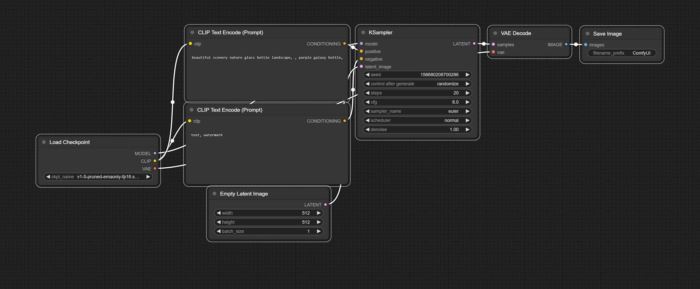

# ComfyUI

ComfyUI is an open-source, node-based interface for Stable Diffusion and other generative-AI models.
Other than most interfaces for generating images, it exposes the underlying pipeline of componants that make image-generation possible. Due to it's flexible node-interface it enables recomposition of existing models and architectures. 

[https://www.comfy.org/] Link to the official Website.

## Installing ComfyUI

1. Download the following notebook [ComfyUI Cloud Install](https://github.com/attributeerror39/experimental-ai-lab/blob/master/experimental_ai_lab/image_generation_embeddings/Comfy%20Cloud%20Install.ipynb)
2. Upload it to your server instance ([jupyter.kittegg.org](https://jupyter.kitegg.de/))
3. Double-Click the notebook to open it
4. Run the two cells using (ctrl/cmd + ENTER)
5. Open the interface by clicking the link in the cell output similar to this one:

> This is the URL to access ComfyUI: https://tennis-oil-extraction-serious.trycloudflare.com                                   |

