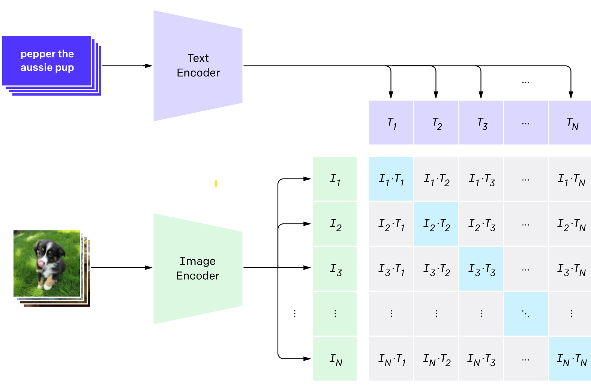
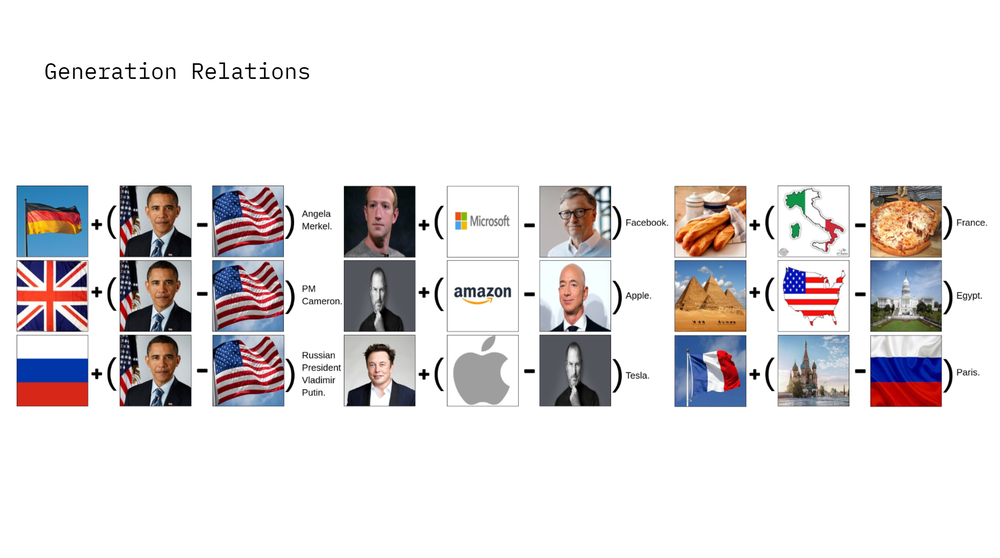

# Text-To-Image Context

## Data

[Have I been trained](https://haveibeentrained.com/)
[Laion 5b](https://laion.ai/blog/laion-5b/)
[Laion Aesthetics](https://laion.ai/blog/laion-aesthetics/)

## Text & Images 
CLIP (Contrastive Language-Image Pre-training) is a dual-encoder model that learns from hundreds of millions of image–caption pairs. It turns each picture and each sentence into a vector, trains so that matching pairs land close together in a shared mathematical space.

[OpenAI CLIP](https://openai.com/index/clip/)

> This shared space enables semantic calculations using simple arithmetic combinations of embeddings.

[ZeroCap](https://github.com/YoadTew/zero-shot-image-to-text)

## What are embedding-spaces?

[Mapping Embeddings](https://leon-etienne.com/umap)

## Stable Diffusion

Stable Diffusion is an open-source text-to-image latent diffusion model: it starts with random noise in a compact latent space, repeatedly removes that noise according to guidance from a CLIP-encoded text prompt.

[Stable Diffusion Explainer](https://poloclub.github.io/diffusion-explainer/)
