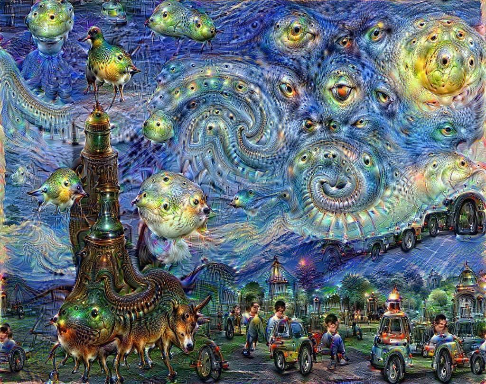

# Intro: The “Undersurface”

## Eigenfaces (1991)

> A 1991 PCA(Principal component analysis)-based technique that treats each aligned face image as a very long vector, then finds the principal components (“eigenfaces”) of the training set. Any new face can be written as a weighted sum of these basis images.

## Deepdream (2015)

> A 2015 visual-debugging hack in which a trained CNN (Convolutional Neural Network) trained on classifying images is run *in reverse*: gradually changing the input image so that chosen neurons fire ever more strongly, amplifying patterns the net has learned.  

## Loab.ai (2022)

> An uncany female figure that artist *@supercomposite* stumbled upon in 2022 while *negatively prompting* a text-to-image model (“generate the opposite of X”). Loab persistently re-appears, often amid gore, when images are blended in her region of latent space. Arguably the first AI-Cryptid.
