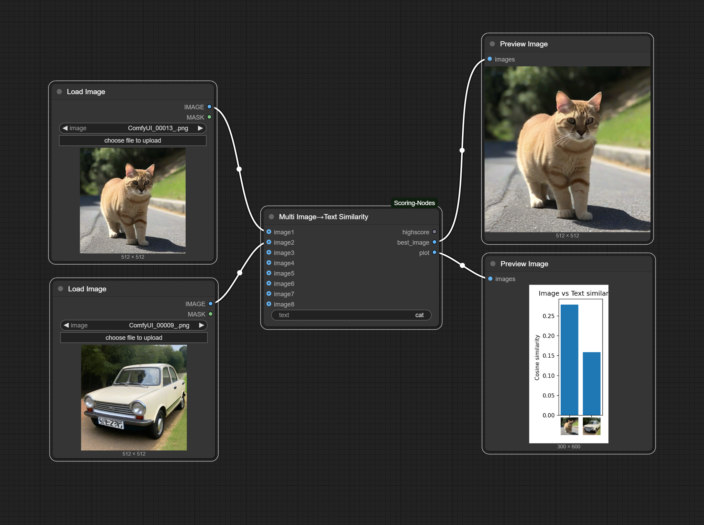
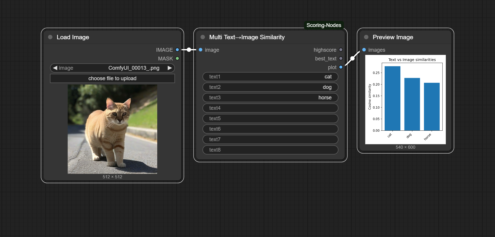
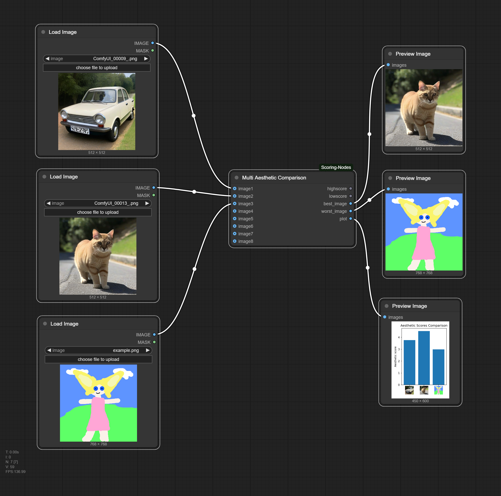

# Scoring

(Drag and Drop these examples into the ComfyUI Window)

## Clip

We can use CLIP directly in ComfyUI to see how closly images and texts correlate in the model.

### Multiple Images and a single text

### Multiple Texts and a single Image

## Aesthetic

We can use the same model that is used for filtering images for Stable Diffusion for our own images. Scores below 5 would not have been part of the first Stable Diffusion Version.

