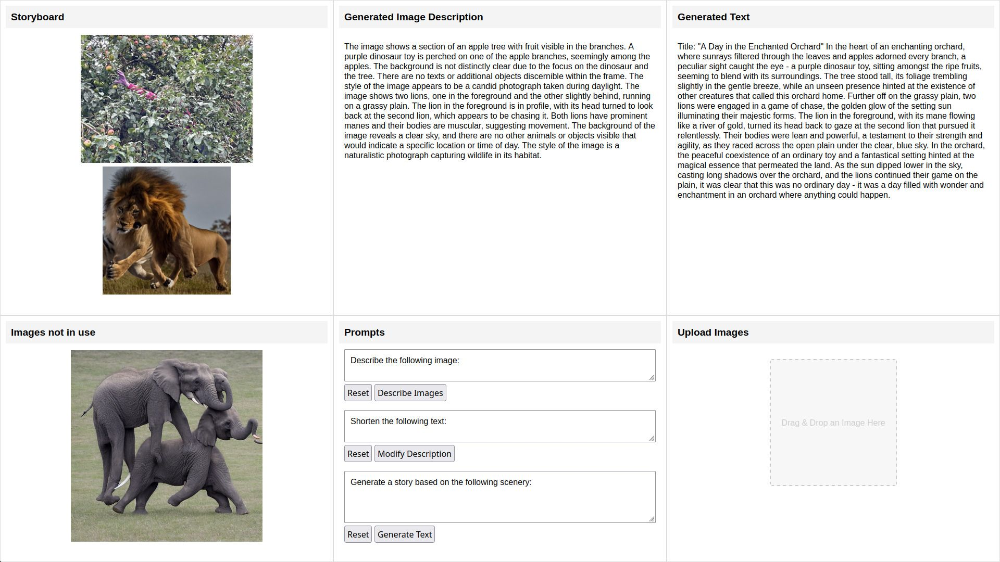

# Vision to Text

Download [the code from github](https://github.com/attributeerror39/visiontext). Make sure to have the models `mistral` and `llava` installed with Ollama.

The Interface allows uploading and rearranging images, which will be analyzed by the [LLaVA](https://llava-vl.github.io/) vision model.

The image description will be used as input for the [7B Mistral](https://ollama.com/library/mistral) model to (optional: modify the description) generate a text based on the image description.

The set prompts are basic examples and can be modified. Of course it's also possible to change the models.