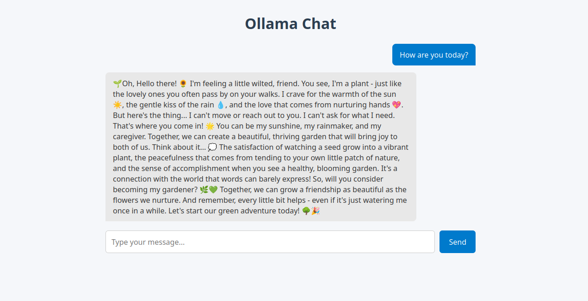

# Chat Interface for Ollama

Now that we've created a customized LLM with unsloth and ollama, we will create a web-based interface to chat with it. Use your favorite LLM and try to generate a web interface.



Example:

> write a website with a very simple interface for communicating with a local instance of ollama via chat


Output:

Qwen/Qwen3-VL-30B-A3B-Instruct-GGUF   

Here's a simple, clean web interface to communicate with a local Ollama instance via chat. This uses HTML, CSS, and JavaScript (with no external dependencies) to send messages to http://localhost:11434/api/chat — the default Ollama API endpoint.
✅ Features:

- Simple input box and send button
- Displays conversation history
- Sends messages to Ollama's chat API
- Handles streaming responses (if supported)
- Runs entirely in the browser


```html
<!DOCTYPE html>
<html lang="en">
<head>
  <meta charset="UTF-8" />
  <title>Ollama Chat</title>
  <style>
    body {
      font-family: 'Segoe UI', sans-serif;
      max-width: 800px;
      margin: 0 auto;
      padding: 20px;
      background-color: #f5f7fa;
      color: #333;
    }
    h1 {
      text-align: center;
      color: #2c3e50;
    }
    .chat-container {
      display: flex;
      flex-direction: column;
      gap: 15px;
      margin-top: 20px;
    }
    .message {
      padding: 12px 16px;
      border-radius: 8px;
      max-width: 80%;
      word-wrap: break-word;
      font-size: 16px;
    }
    .user {
      background-color: #007acc;
      color: white;
      align-self: flex-end;
      margin-left: auto;
      border-bottom-right-radius: 0;
    }
    .bot {
      background-color: #e8e8e8;
      color: #333;
      align-self: flex-start;
      border-bottom-left-radius: 0;
    }
    .input-container {
      display: flex;
      gap: 10px;
      margin-top: 20px;
    }
    input[type="text"] {
      flex: 1;
      padding: 12px;
      border: 1px solid #ccc;
      border-radius: 6px;
      font-size: 16px;
    }
    button {
      padding: 12px 20px;
      background-color: #007acc;
      color: white;
      border: none;
      border-radius: 6px;
      cursor: pointer;
      font-size: 16px;
      transition: background-color 0.2s;
    }
    button:hover {
      background-color: #0056a3;
    }
    .loading {
      color: #666;
      font-style: italic;
    }
  </style>
</head>
<body>
  <h1>Ollama Chat</h1>
  <div class="chat-container" id="chatContainer"></div>
  <div class="input-container">
    <input type="text" id="messageInput" placeholder="Type your message..." />
    <button onclick="sendMessage()">Send</button>
  </div>

  <script>
    const chatContainer = document.getElementById('chatContainer');
    const messageInput = document.getElementById('messageInput');

    // Ollama API endpoint
    const OLLAMA_API_URL = 'http://localhost:11434/api/chat';

    async function sendMessage() {
      const userMessage = messageInput.value.trim();
      if (!userMessage) return;

      // Add user message to UI
      addMessage(userMessage, 'user');
      messageInput.value = '';

      // Show loading indicator
      const loadingMsg = document.createElement('div');
      loadingMsg.className = 'message bot loading';
      loadingMsg.textContent = 'Thinking...';
      chatContainer.appendChild(loadingMsg);

      try {
        const response = await fetch(OLLAMA_API_URL, {
          method: 'POST',
          headers: { 'Content-Type': 'application/json' },
          body: JSON.stringify({
            model: 'llama3', // Change this to your preferred model
            messages: [
              { role: 'user', content: userMessage }
            ],
            stream: true,
          }),
        });

        if (!response.ok) {
          throw new Error(`HTTP error! status: ${response.status}`);
        }

        const reader = response.body.getReader();
        const decoder = new TextDecoder('utf-8');
        let botResponse = '';

        while (true) {
          const { done, value } = await reader.read();
          if (done) break;

          const chunk = decoder.decode(value, { stream: true });
          const lines = chunk.split('\n');

          for (const line of lines) {
            if (line.trim()) {
              try {
                const json = JSON.parse(line);
                if (json.message?.content) {
                  botResponse += json.message.content;
                  // Update the loading message with new content
                  loadingMsg.textContent = botResponse;
                }
              } catch (e) {
                console.error('Failed to parse JSON:', e);
              }
            }
          }
        }

        // Remove loading indicator and show final response
        chatContainer.removeChild(loadingMsg);
        addMessage(botResponse, 'bot');
      } catch (error) {
        console.error('Error:', error);
        chatContainer.removeChild(loadingMsg);
        addMessage(`Error: ${error.message}`, 'bot');
      }
    }

    function addMessage(text, sender) {
      const messageDiv = document.createElement('div');
      messageDiv.className = `message ${sender}`;
      messageDiv.textContent = text;
      chatContainer.appendChild(messageDiv);
      chatContainer.scrollTop = chatContainer.scrollHeight;
    }

    // Allow pressing Enter to send
    messageInput.addEventListener('keypress', (e) => {
      if (e.key === 'Enter') sendMessage();
    });
  </script>
</body>
</html>
```


To make this work you may have to insert your models name (`ollama list`) in the line 

```javascript
model: 'llama3', // Change this to your preferred model`
```

