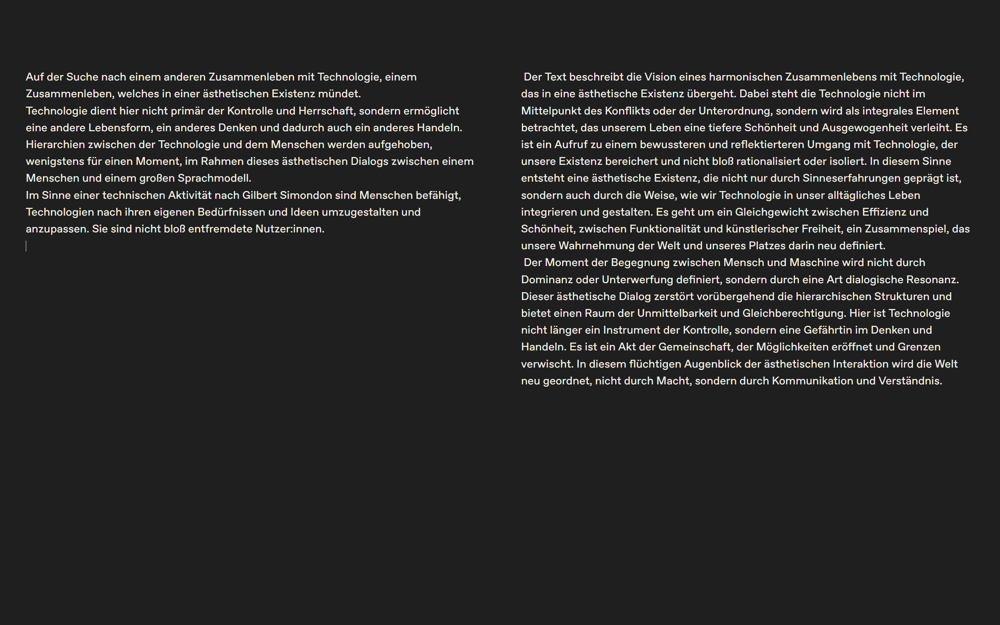
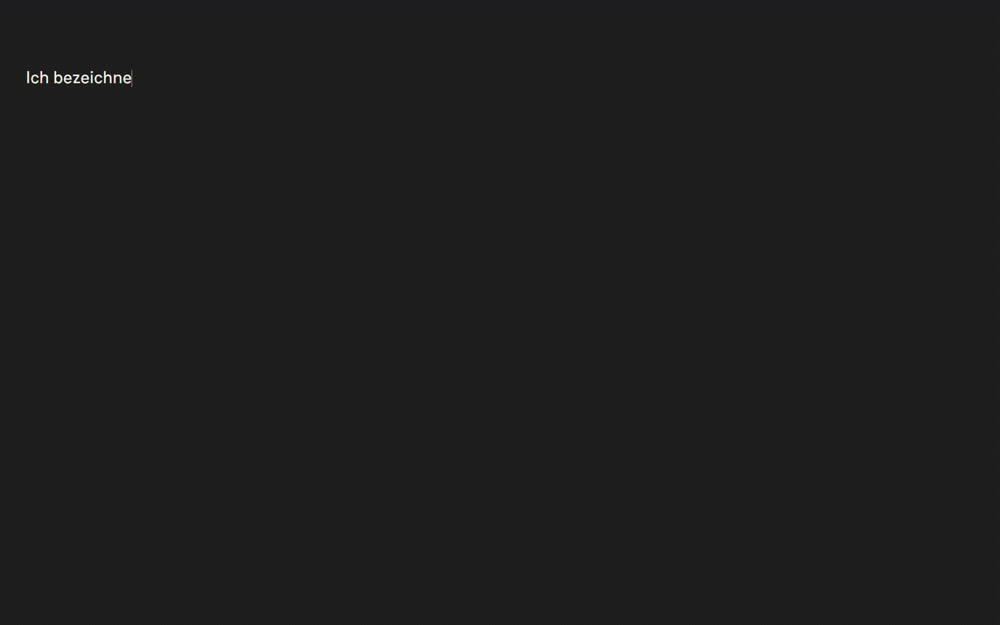
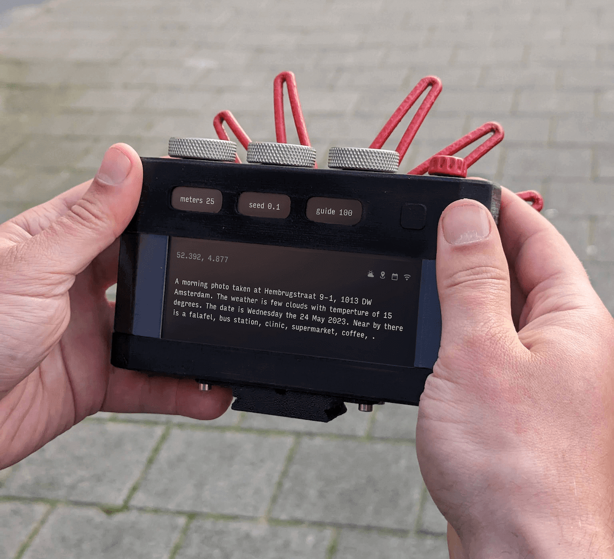
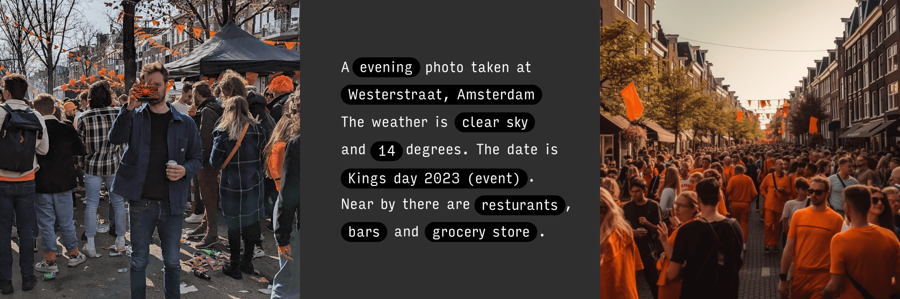
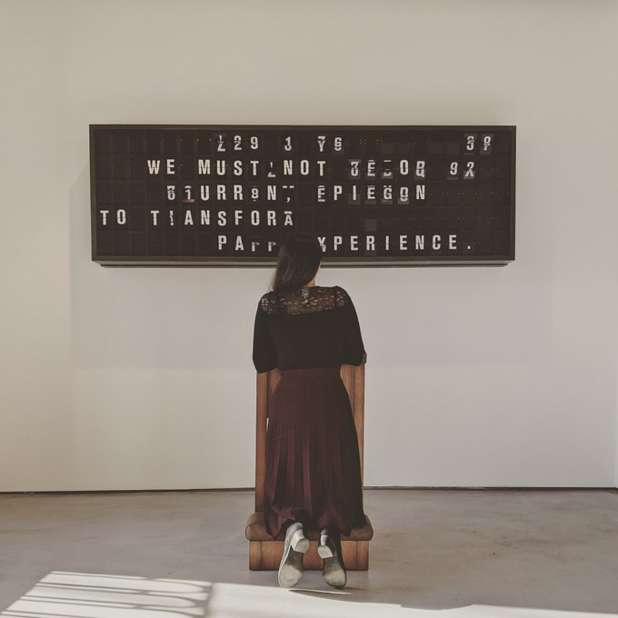
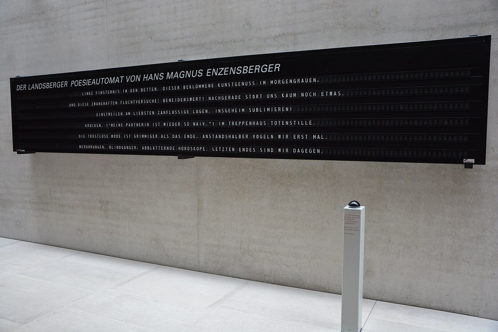
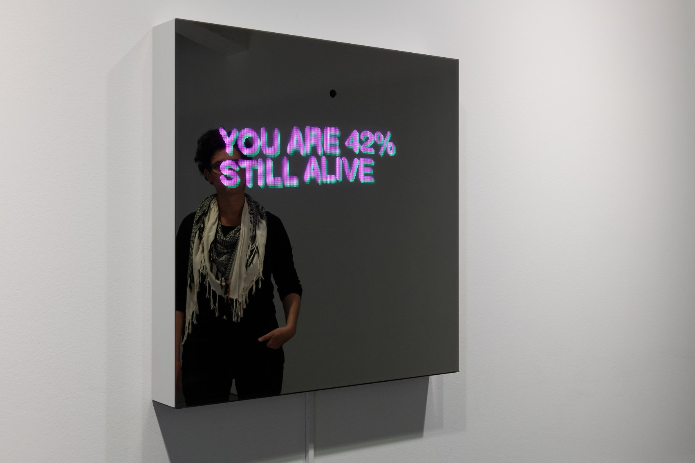
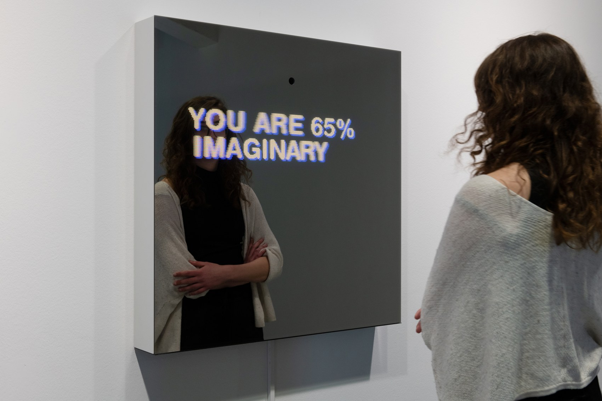

# Interface

## Examples

### Mattis Kuhn – neither host nor guest (2024/25)

[Project page](https://mattiskuhn.com/neither-host-nor-guest-performance/)

> »neither host nor guest« is an aesthetic human-AI dialog in the mode of archaic friendliness, as expressed in the Zen phrase „neither host nor guest / host and guest apparently“. There is no distinction between host and guest, between I and you, between human and AI, but a relationship of openness and indifference.
>
> The form of archaic friendliness is simulated in a large language model (LLM) and realized through an interface of simultaneity in the interaction between human and LLM. The project seeks forms of a human-machine relationship that is less characterized by thinking in distinctions, that aims less at control and domination by means of technology, but sees technology as part of an aesthetic existence. 

```{margin}
Mattis Kuhn – neither host nor guest (2024/25)<br>LLM (Mistral Small), system prompt, custom web interface

```


```{margin}
Mattis Kuhn – neither host nor guest (2024/25)<br>LLM (Mistral Small), system prompt, custom web interface

```



### Bjoern Karmann: Paragraphica (2023)

[Project page](https://bjoernkarmann.dk/project/paragraphica)

```{margin}
Bjoern Karmann: Paragraphica (2023)
```


<br>

```{margin}
Bjoern Karmann: Paragraphica (2023)
```


<br>

> Paragraphica is a context-to-image camera that uses location data and artificial intelligence to visualize a "photo" of a specific place and moment. The camera exists both as a physical prototype and a virtual camera that you can try. 

### Mario Klingemann: Appropriate Response (2020)

[Project page](https://quasimondo.com/2020/08/29/appropriate-response/)

```{margin}
Mario Klingemann: Appropriate Response (2020)
```


<br>

> How much meaning can be expressed in just 120 letters? 

> “Words are probably the most powerful tools available to humankind. Words can make people do things, can change their lives,” marketing slogans or self-help phrases, short phrases abound as a source of inspiration and guidance.


### Hans Magnus Enzensberger: Landsberger Poesieautomat (2000)

```{margin}
Von Hans Magnus Enzensberger - Eigenes Werk, CC BY-SA 4.0, https://commons.wikimedia.org/w/index.php?curid=43553446
```


<br>

### Sebastian Schmieg: Decisive Mirror (2019)

[Project page](https://sebastianschmieg.com/decisive-mirror/)

```{margin}
Sebastian Schmieg: Decisive Mirror (2019)<br>Zwei-Wege-Spiegel, LED-Matrix, Computer, Kamera, Datenset, Neurales Netzwerk
```


<br>

```{margin}
Sebastian Schmieg: Decisive Mirror (2019)<br>Zwei-Wege-Spiegel, LED-Matrix, Computer, Kamera, Datenset, Neurales Netzwerk
```


<br>

Die Arbeit besteht aus einem Zwei-Wege-Spiegel mit integrierter Kamera und einer LED-Matrix. Die aufgenommenen Bilder werden mittels einer Gesichtserkennung analysiert, welche auf unkonventionelle Kategorien trainiert wurde. Sie liefert uns zu unserem Gesicht Bewertungen wie "YOU ARE 22% FRAGMENTED", "YOU ARE 1% PREDICTABLE", "YOU ARE 12% IMPROVED".