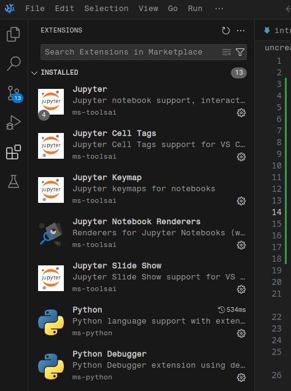
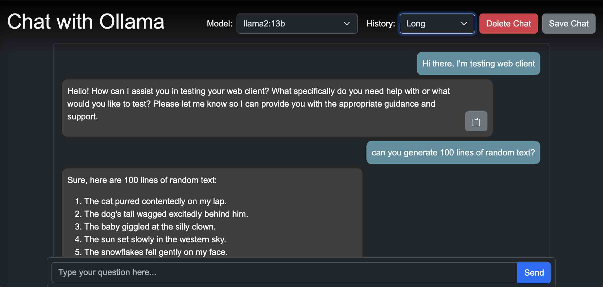
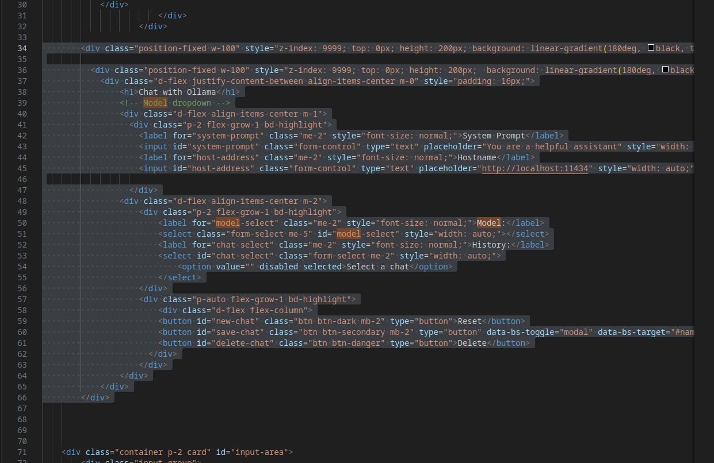
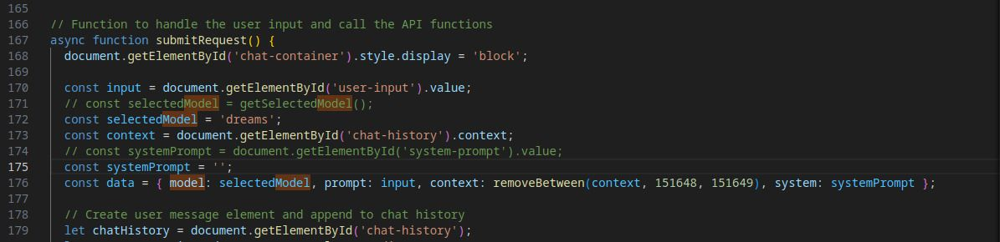
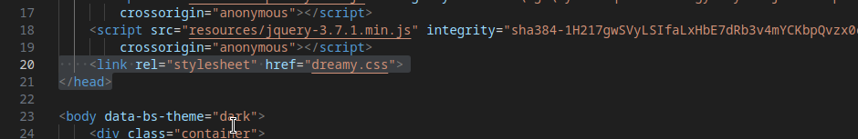
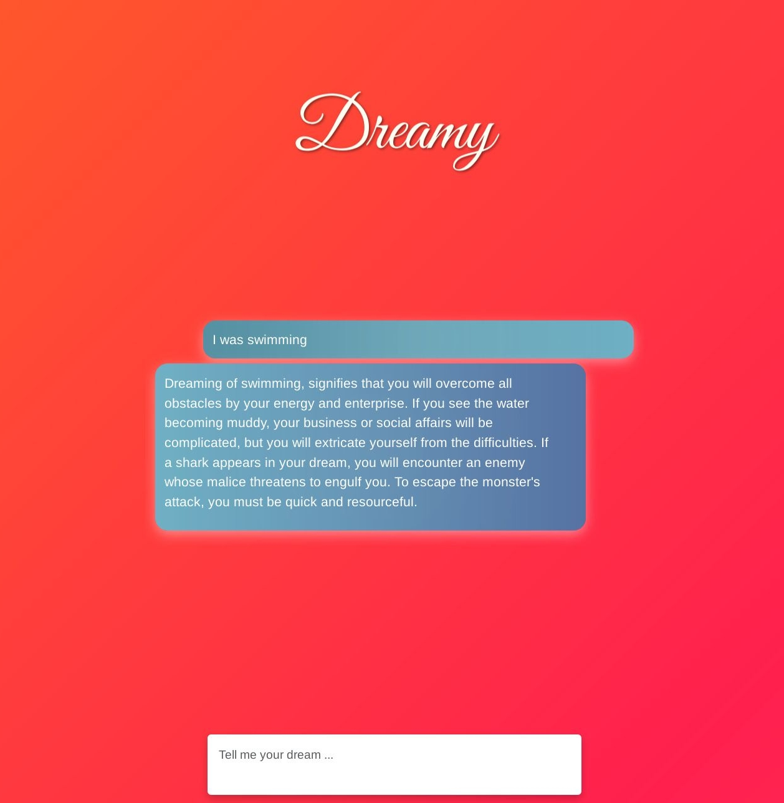

# Interface: Dream Interpreter (with ollama-ui)

## Code Editor 

We'll work with VSCode / VSCodium:

[VSCode](https://code.visualstudio.com/) — VSCode developed by Microsoft

[VSCodium](https://vscodium.com/) — VSCode without tracking and telemetry

### Extensions

After installation, go to the `Extensions`-tab and install the following extensions:

- Python 
- Jupyter
- Live-Server



## Virtual environment

It is recommended to create a virtual environment for your project/ setup. All the libraries and dependencies installed for this project are isolated and won't conflict other libraries and their dependencies. The easiest way to create a virtual environment is **conda**.

### Miniconda

[Download](https://www.anaconda.com/download/success#miniconda) Miniconda for your OS and execute the installer. 

Open the Terminal inside VSCode: `Terminal` -> `New Terminal` and type the following commands, line by line, execute each one of them with pressing `Enter`.

``` shell
# check if conda is installed
conda --version
```

### Create a new environment

``` shell
# create a new environment called "lab" with Python version 3.12
conda create -n lab python=3.12 -y
```

The word after the `-n` flag (in this case "lab") is the name of your environment and you have to type it when you start it later on, so make sure it's not too long and easy to remember.


You can see all environments created by you with the following command:

```shell
# list available environments
conda env list
```

Next we can activate our newly created environment.

```shell
# activate your environment
conda activate lab
```

### Install external packages with pip

We can use Python's package installer **pip** to install external libraries like [jupyter](https://pypi.org/project/jupyter/)

```shell
# important: activate your environment first
conda activate lab

# install the library jupyter with pip
pip install jupyter
```

### Deactivate conda

When we've finished our work, we can deactivate the environment with:

```shell
# deactivate environment
conda deactivate
```

### Remove an environment

```shell
conda remove -n <my environment> --all
```

### Python

[Python](https://www.python.org/) is an easy to write general purpose programming language, meaning it can be used for a variety of different applications.


## Installing the ollama-ui

```{margin}
ollama-ui (default interface)<br>
[Source](https://github.com/ollama-ui/ollama-ui)
```


[github](https://github.com/ollama-ui/ollama-ui)

```shell
git clone https://github.com/ollama-ui/ollama-ui
cd ollama-ui
rm -r .git*  # confirm with 'y'
make

open http://localhost:8000 # in browser
```

OR use the Live-Server plugin using right-click `Open with Live-Server`.

Removing the integrity to avoid errors, open the `index.html` and remove the `integrity="..."` attributes.


## Using the interface

The interface has several drop-down fields for selecting the model, defining a system prompt etc. We want to reduce this functionality to serve only the purpose of interpreting our dreams.

Remove the select menu from `index.html`:



Change the placeholder "Type your question here ..."

Open `chat.js` and set a fixed model and remove the system prompt:



Optional: Remove the copy button (`let copyButton` and the following lines).

Modify the style of the page (`chat.css`) by hand or with your favorite chatbot. Best save it as a new file like `dreamy.css` and change the corresponding section in `index.html`:





## Adding Text-to-Speech

We can use the browsers internal text-to-speech functionality using the [SpeakIt](https://mobilepadawan.github.io/Speakit-JS/) library in JavaScript.

Paste the following snippet at the end of your `index.html` just after `<script src="chat.js"></script>`:

```
  <div class="m-2 position-fixed">
    <label for="language-select" class="me-2" style="font-size: normal;">
      Language:
    </label>
    <select
      id="language-select"
      class="form-select"
      style="width: auto;"
    >
      <option value="" disabled selected>Pick a language…</option>
    </select>
  </div>
  <script src="https://mobilepadawan.github.io/Speakit-JS/ttsl/js/Speakit1.0.0.min.js"></script>
  <script>
    const languageSelect = document.getElementById('language-select');

    // Populate the select with available voices
    async function loadVoices() {
      try {
        const voices = await Speakit.getVoices();
        languageSelect.innerHTML = '<option value="" disabled selected>Pick a language…</option>';
        voices.forEach(voice => {
          const opt = document.createElement('option');
          opt.value = voice.lang;
          opt.dataset.voice = voice.name;
          opt.textContent = `${voice.lang} – ${voice.name}`;
          console.log(`${voice.lang} – ${voice.name}`)
          languageSelect.append(opt);
        });
      } catch (e) {
        console.error('Failed to load voices', e);
      }
    }

    /**
     * Speak the given text using the currently selected language/voice.
     * @param {string} text The text to be spoken.
     * @returns {Promise<void>}
     */
    function speakText(text) {
      const lang = languageSelect.value;
      const voiceName = languageSelect.selectedOptions[0]?.dataset.voice;

      if (!lang || !text) {
        return Promise.reject(new Error('Please select a language before speaking.'));
      }

      return Speakit
        .readText(text, lang, voiceName);
    }

    // initialize voices on page load
    loadVoices();
  </script>
```

Now add the speaking-functionality in `chat.js` after line `239` like in the following example:

```
.then(() => {
    stopButton.remove(); // Remove stop button from DOM now that all text has been generated
    spinner.remove();
    speakText(responseDiv.innerText) // Add this line
})
```