# Hands-On AI

We make AI systems tangible through artistic research and aesthetic experiments and reflect on their effects on practice and context. The aim of the course is to provide a deeper, practical understanding of AI technologies.

In the first phase of the course, we will learn about various AI technologies together in workshop formats and explore them experimentally. The second phase of the course is dedicated to individual prototyping based on the workshops. In the workshops, we will deal with tokens and prompting, LLMs, fine-tuning, chatbots and interfaces, image generation and embeddings, video generation, etc.

## Gregor Weichbrodt — Eine Liste (2020)

[Project page](https://gregorweichbrodt.de/project/eine-liste-bot/)

```{margin}
Gregor Weichbrodt — Eine Liste (2020)<br>
Bot, Website
```

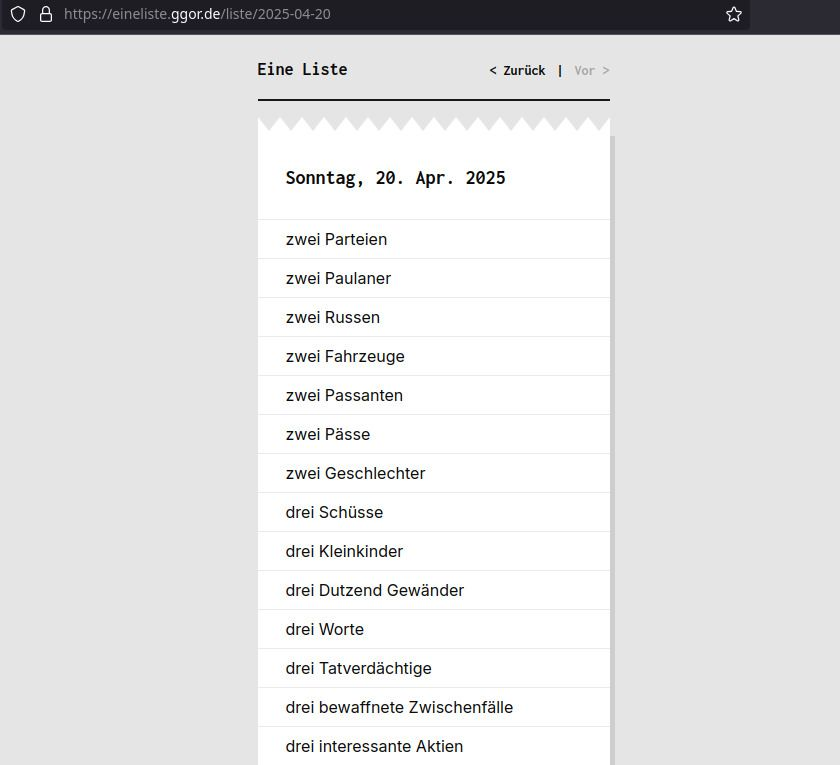

<br>

```{margin}
Gregor Weichbrodt — Eine Liste (2020)<br>
Bot, Website
```

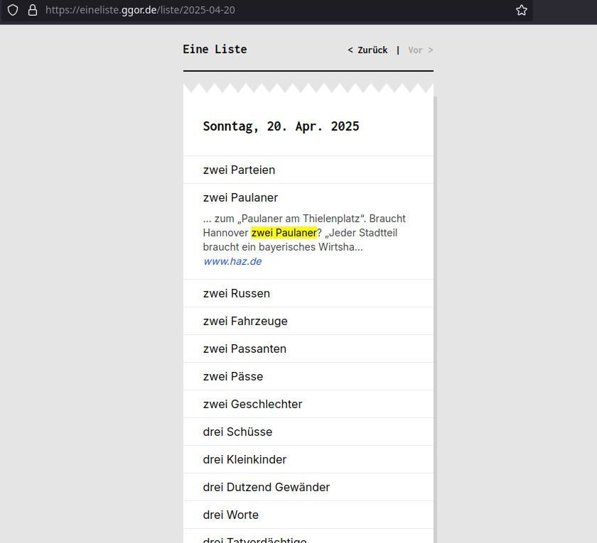

<br>

> Searches current news texts for countable items and generates lists.

<br>

## Lauren Lee McCarthy — LAUREN (2017-)

[Project page](https://lauren-mccarthy.com/LAUREN)

```{margin}
Lauren Lee McCarthy — LAUREN (2017-)<br>
Objects
```

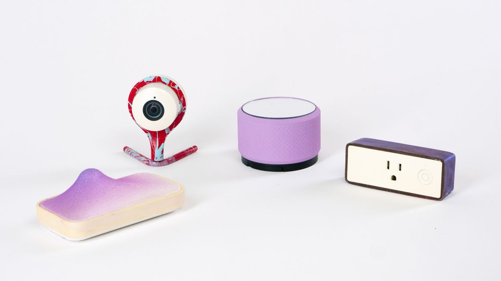

<br>

```{margin}
Lauren Lee McCarthy — LAUREN (2017-)<br>
Interface
```

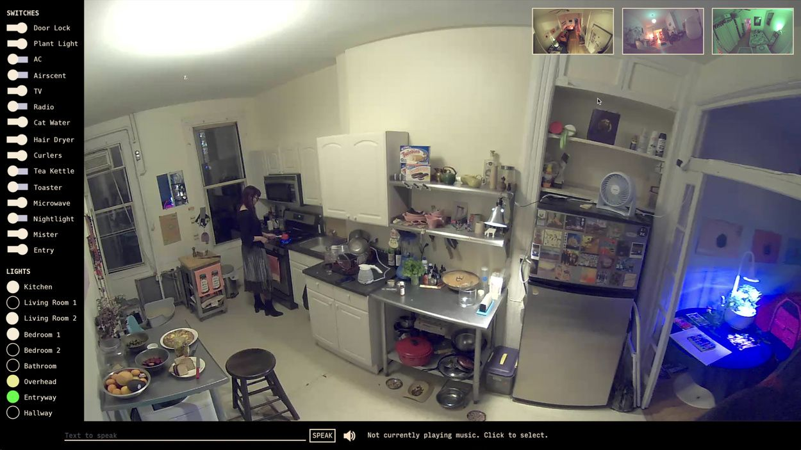

<br>

```{margin}
Lauren Lee McCarthy — LAUREN (2017-)<br>
Installation View Frankfurter Kunstverein<br>
Photo: Norbert Miguletz
```

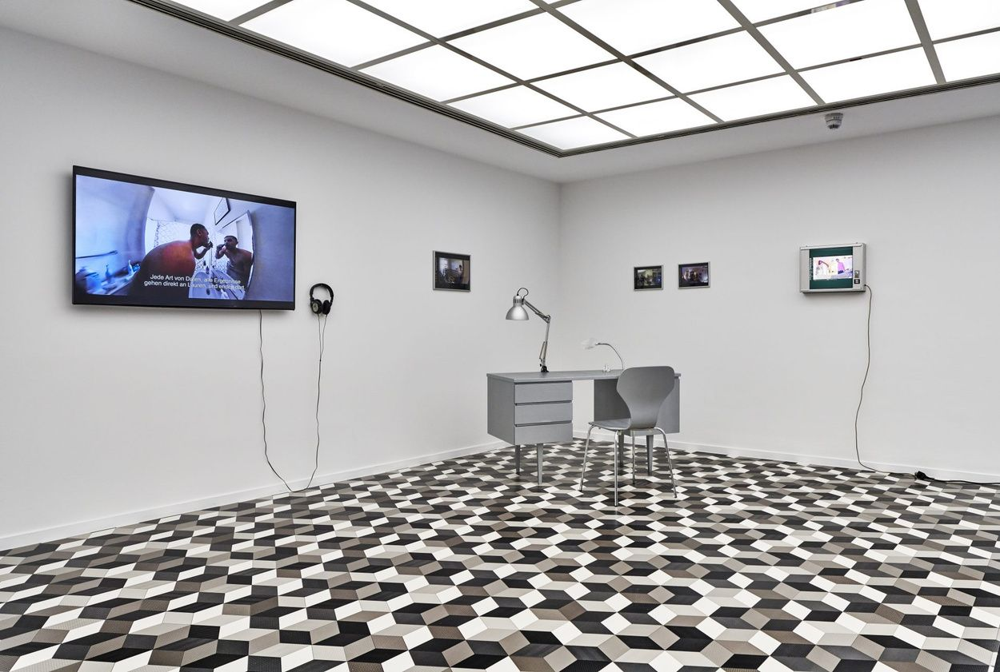

<br>

> I attempt to become a human version of Amazon Alexa, a smart home intelligence for people in their own homes. The performance lasts several days. It begins with an installation of a series of custom designed networked smart devices (including cameras, microphones, switches, door locks, faucets, and other electronic devices). I then remotely watch over the person 24/7 and control all aspects of their home. I aim to be better than an AI because I can understand them as a person and anticipate their needs. The relationship that emerges falls in the ambiguous space between human-machine and human-human.

<br>

## Dries Depoorter — The Flemish Scrollers (2021-2025)

[Project page](https://driesdepoorter.be/theflemishscrollers/)

```{margin}
Dries Depoorter — The Flemish Scrollers (2021-2025)<br>
Custom server, bot, object detection, face detection, ffmpeg
```

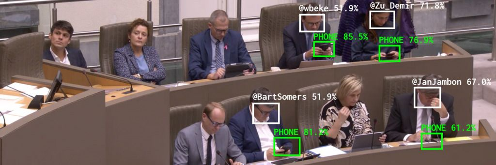

<br>

```{margin}
Dries Depoorter — The Flemish Scrollers (2021-2025)<br>
Custom server, bot, object detection, face detection, ffmpeg
```

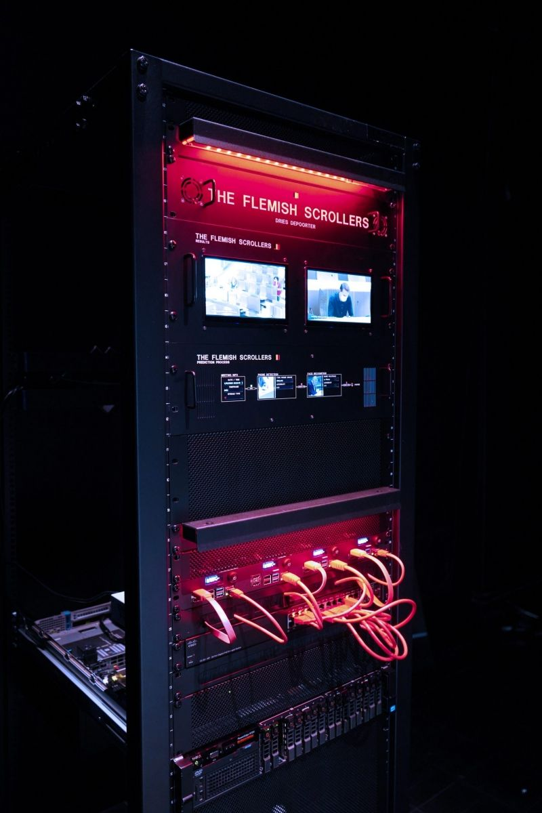

<br>


> Automatically tagging Belgian politician when they use their phone on the daily livestreams. With the help of AI. 
>
> Every meeting of the flemish government in Belgium is live streamed on a youtube channel. When a livestream starts the software is searching for phones and tries to identify a distracted politician. This is done with the help of AI and face recognition. The video of the distracted politician are then posted to a Twitter and Instagram account with the politician tagged.

<br>

## Lily McCraith – Now Make This (2020)

[Artist page](https://lilymccraith.net)

> What happens when designers follow machine generated instructions? This AI device generates sets of instructions for projects. Prototyped using Arduino and a thermal receipt printer, and AI text generated using GPT2 Neural Network.

```{margin}
Lily McCraith – Now Make This (2020)<br>AI, Arduino, Prototyping

```
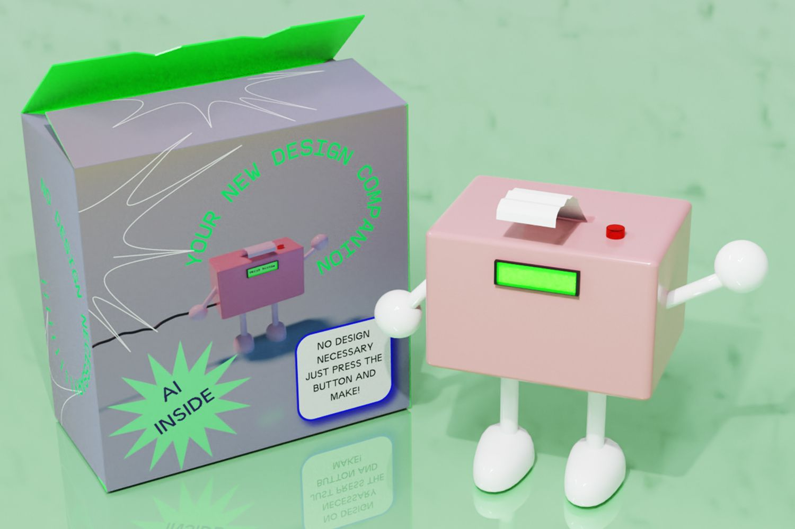

<br>

```{margin}
Lily McCraith – Now Make This (2020)<br>AI, Arduino, Prototyping

```
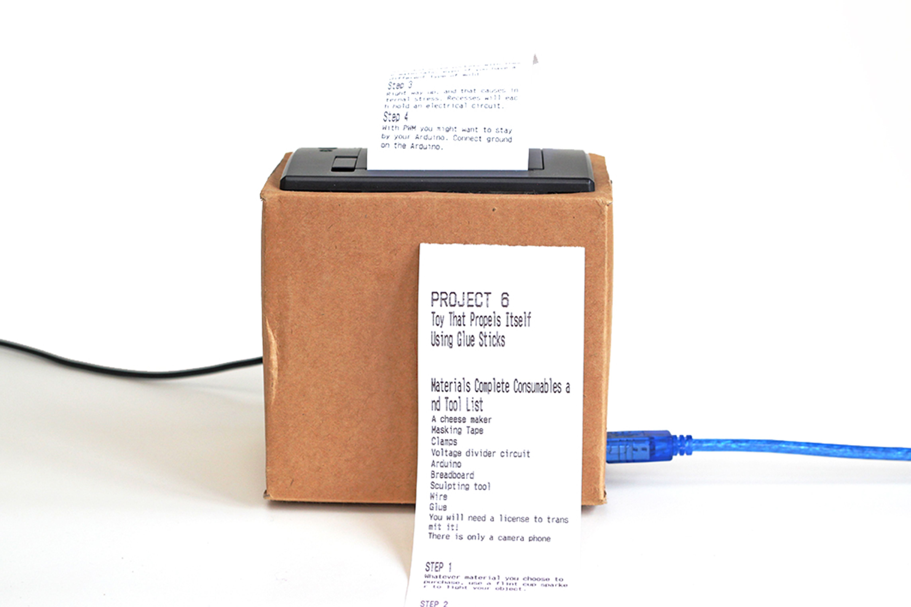

<br>

```{margin}
Lily McCraith – Now Make This (2020)<br>AI, Arduino, Prototyping

```
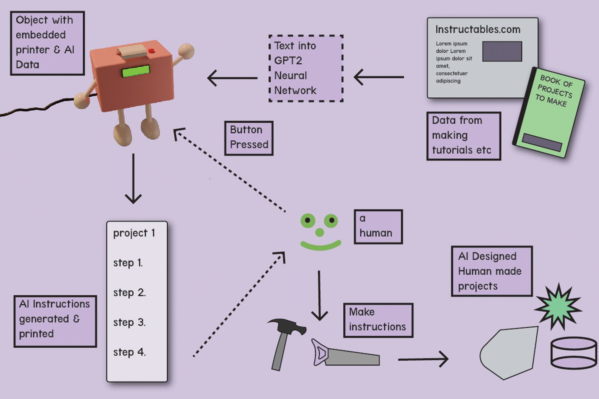

<br>

## Lasse Scherffig, Thomas Hawranke — Colossal Cave Adventure — The Movie (2022)

[Project page](http://lassescherffig.de/projects/colossal-cave-adventure-the-movie/)

```{margin}
Lasse Scherffig, Thomas Hawranke — Colossal Cave Adventure — The Movie (2022)<br>
AI, custom software
```

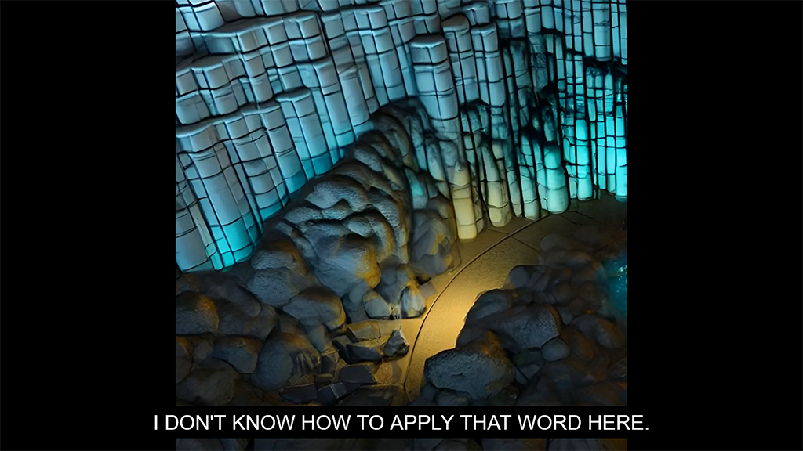

> The project deals with one of the first text-based adventure games in computer game history. Colossal Cave Adventure was developed by Will Crowther in 1976 and is based on the spatial presence of Mammoth Cave in Kentucky. Crowther’s game completely avoids a visual representation of the cave – instead, text input and text response shape the cave in the player’s individual perception. The AI-based animated film is approximately 55 minutes long. The camera constantly moves downwards, digging through geological layers and exposing new cave spaces again and again. Every eight seconds, the AI system receives a new textual description. These descriptions are taken from the 1976 source code of the game, which contains a total of 379 inputs ranging from narrative descriptions of nature, to jargon from the vocabulary of speleologists, to single words meaning an object, a compass direction, or an exclamation.

<br>
