# LLMs

## Artistic projects

Below are some examples of artistic practice with language computation. They give an overview of the recent history, so some are predecessors to LLMs. 

### Jasper Rigole: 500 letters (2010)

[Project page](https://www.jasperrigole.com/500-letters/)

[Interface](https://500letters.org/)

```{margin}
Jasper Rigole: 500 letters (2010)
```
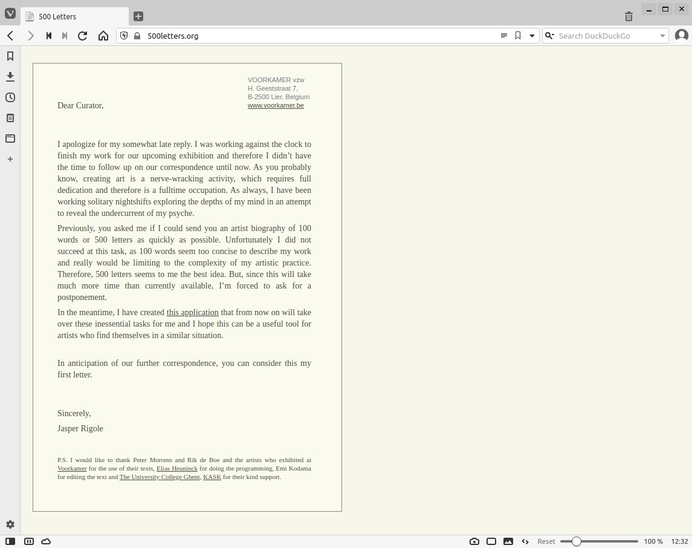

<br>

```{margin}
Jasper Rigole: 500 letters (2010)
```
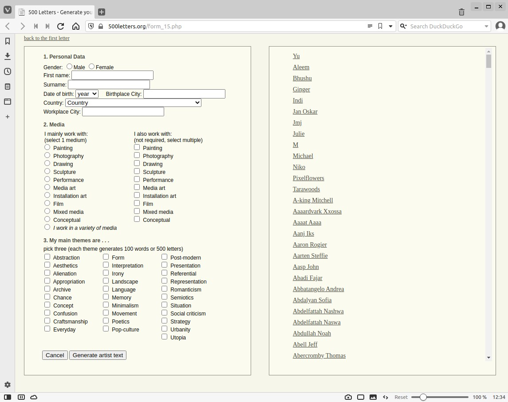

<br>

```{margin}
Jasper Rigole: 500 letters (2010)
```
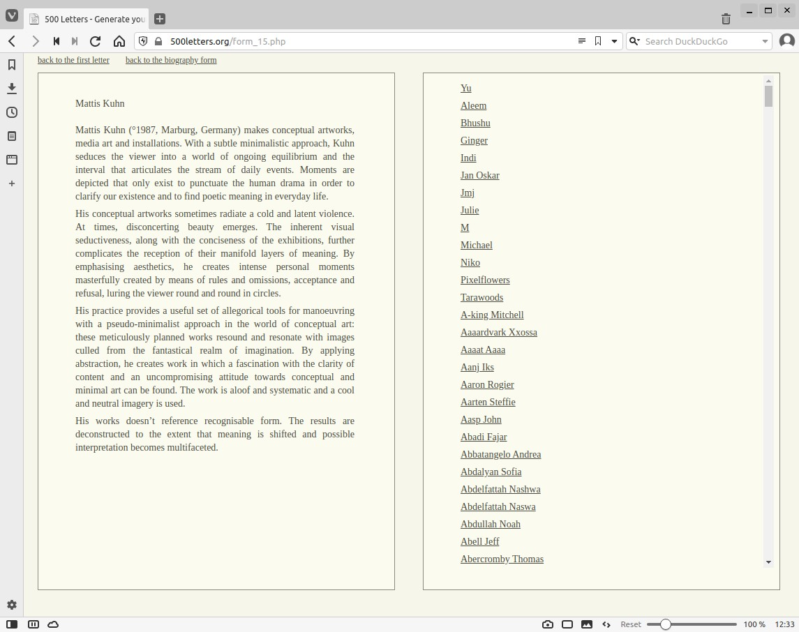

<br>

> **500 Letters** is an artist text generator that draws on a database of sentences written in the all too characteristic vocabulary  of artists’ statements. Supplied with a combination of keywords (for  example *irony*, *landscape*, *appropriation*, *semiotics* etc.) and a specific medium, the work spews out a plausible artist’s  statement. While this automatic biography generator is itself of course  tinged with irony, some artists may find it a useful tool for generating their own texts. ([Source](https://www.jasperrigole.com/500-letters/))

<br>

### DISNOVATION.ORG Predictive Art Bot (2015-18)

[Project page](https://disnovation.org/pab.php)

[Online version](http://predictiveartbot.com/)


```{margin}
DISNOVATION.ORG Predictive Art Bot
CONCEPTION: DISNOVATION.ORG
PROGRAMMING: JÉRÔME SAINT-CLAIR
NATURAL LANGUAGE PROCESSING, WEBSITE, INSTALLATION
PROTOTYPE | 2015–2018
```
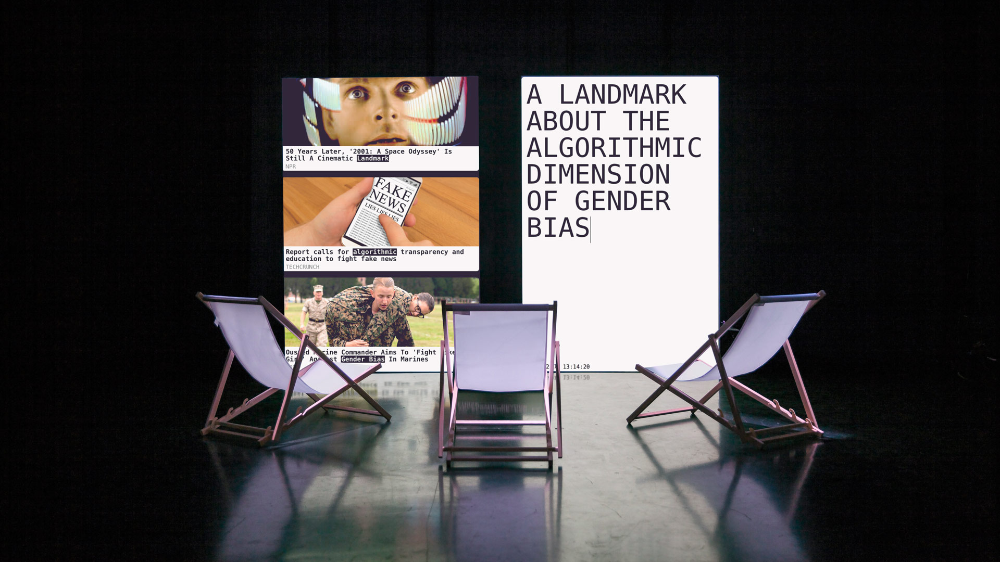

<br>

```{margin}
DISNOVATION.ORG PREDICTIVE ART BOT - V4 - ONLINE VERSION - 2018
CONCEPTION: DISNOVATION.ORG
PROGRAMMING: JÉRÔME SAINT-CLAIR
NATURAL LANGUAGE PROCESSING, WEBSITE, INSTALLATION
PROTOTYPE | 2015–2018
```
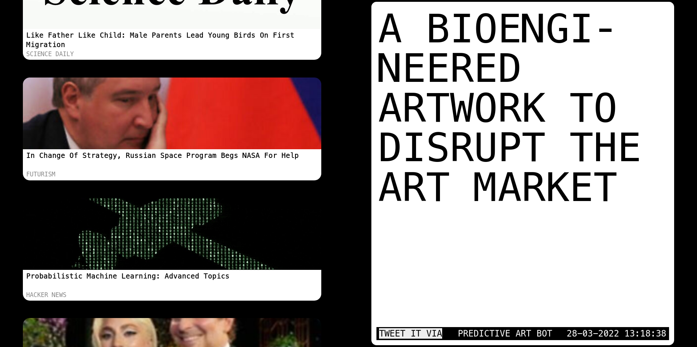

<br>

>In the age of hyperconnectivity, the perverse implications of media echo chambers are becoming more and more obvious. Groups of similar behaviors are being partitioned in filter bubbles, while the few massively reposted topics tends to monopolize most of the available attention. Such insular echo chambers strongly affect ways of thinking, resulting in increasingly homogeneous imaginaries within groups of like-minded people.<br><br>Predictive Art Bot caricatures the predictability of media influenced artistic concepts, by automating and skirting the human creative process. But beyond mere automation, it aims to stimulate unbridled, counter-intuitive and even disconcerting associations of ideas.<br><br>To do so, it continually monitors emerging trends among the most influential news sources in fields as heterogeneous as politics, environment, innovation, culture, activism, or health... On this basis, it identifies and combines keywords to generate concepts of artworks in a fully automated way, ranging from unreasonable to prophetic through absurd. Each prediction becomes a thought experiment waiting to be incubated, misused or appropriated by a human host.

<br>

### Ross Goodwin – 1 the Road (2019)

```{margin}
Ross Goodwin – 1 the Road (2019)
```
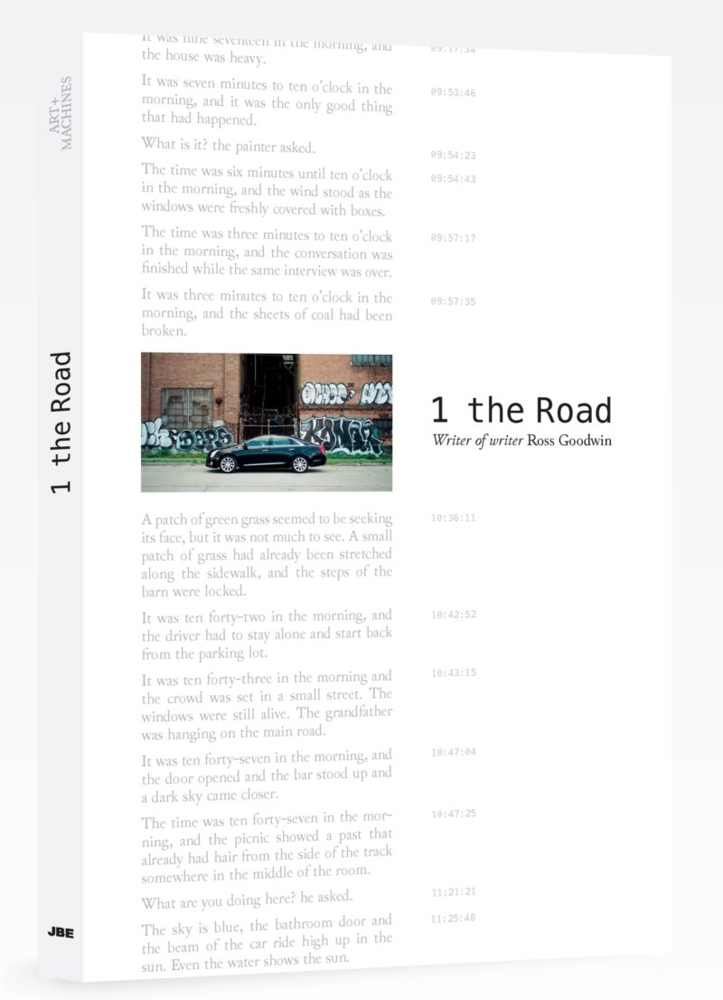

<br>

```{margin}
Ross Goodwin – 1 the Road (2019)
```
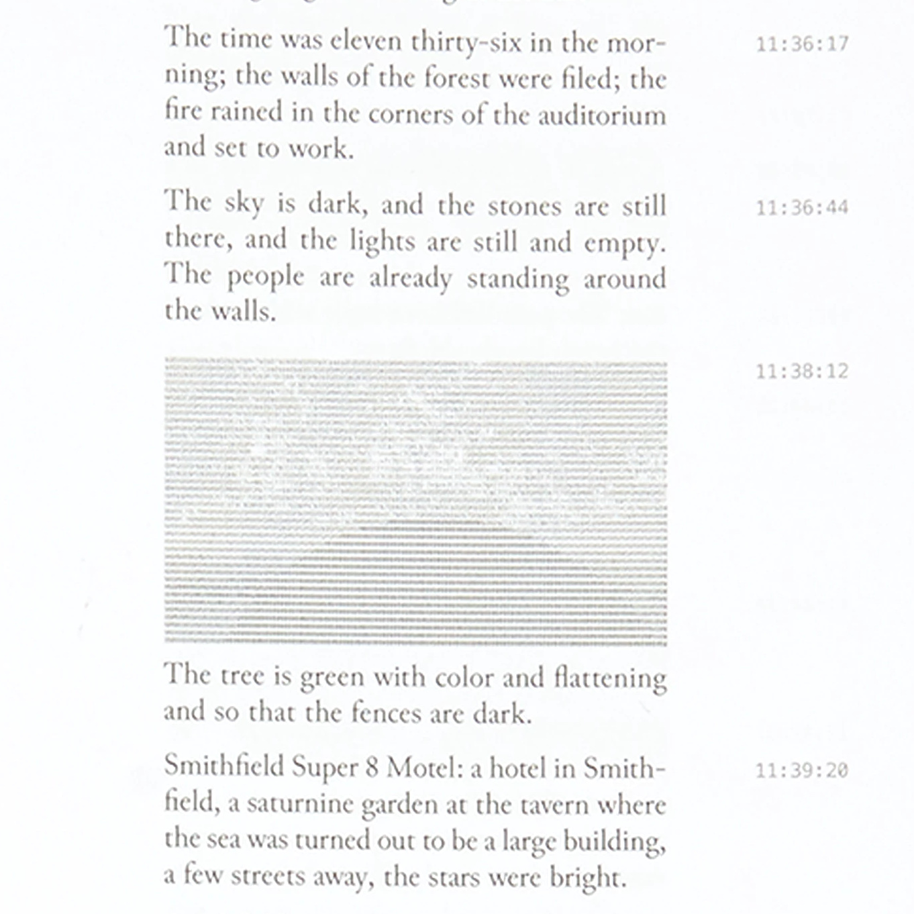

<br>

1 the Road takes up the genre of American travel novels. Ross Goodwin trained an LSTM with almost 200 books from relevant literature (Jack Kerouac: On the Road, Tom Wolfe: The Electric Kool-Aid Acid Test, Hunter S. Thompson: Hell's Angels).  Goodwin equipped a car with a camera, GPS, a microphone, and a clock. All the information converged in a portable AI. He drove from New York to New Orleans with acquaintances and had his AI write a travel report.


### Julia Nakotte: Potentio Poet (2021)

[Project page](https://ground-zero.khm.de/portfolio/potentio-poet/)

```{margin}
Julia Nakotte: Potentio Poet (2021)
```
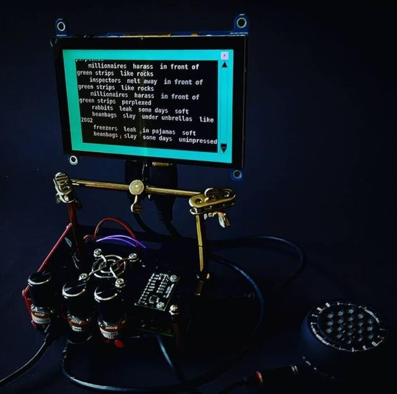

<br>

> The Potentio Poet is an independent, authentic and creative author,  that generates an endless poem based on a simple random-function in  Python code.
>
> I selected nouns, verbs, adjectives and locations and rated them on a scale from 1 (a little) to 3 (much) in the categories *everyday life*, *city* and *depression*. Each word received a score in each of the three categories. This  resulted in 27 possible combinations. A third person decides on which  rating combination the next line of the poem is based by turning three  analog potentiometers. The code selects a random noun, a random verb, a  random location and a random adjective from the matching combination and strings them together in an random order. The potentiometers can be  combined differently for each poem line. If the person wants to make the poem more depressing, he or she turns up the depression potentiometer.
>
> **The focus of this work is not on the output or the  presentation of the technical possibilities, but on the staging of the  machine as an author.** The potentio poet is presented as an  independent author, while influencing persons are downgraded to  assistants, who only select and rate words or chose the base of a poem  line . Although the potentio poet uses only a simple random function for its part of the work, this is enough to make it impossible for us to  foresee the total result. Is this enough to call the potentio poet an  author? Why should it not be enough? In what ways are the potentio  poet’s influences different from the influences that affect human  authors (like a language, experiences, education)?
>
> If there is potential for discussion even with such a simple code,  it’s exciting what kind of conversations we will/should have in relation to text-generating AI and more complex technologies. ([Source](https://ground-zero.khm.de/portfolio/potentio-poet/))

<br>

### Hannes Bajohr: (Berlin, Miami) (2023)

[Project page](https://hannesbajohr.de/en/2023/09/25/new-novel-berlin-miami/)

```{margin}
Hannes Bajohr: (Berlin, Miami) (2023)
```
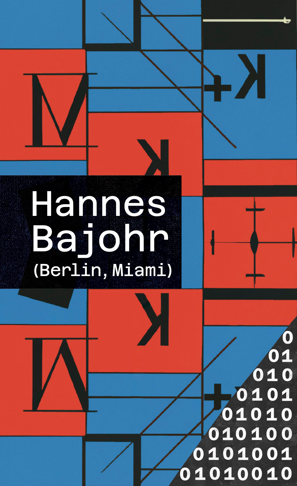

<br>

Models used: GPT-J and GPT-NeoX, both trained on ThePile

Finetuned with:  
Joshua Groß, *Flexen in Miami* — 14,45%  
Berit Glanz, *Pixeltänzer* — 17,22%  
Julia Zange, *Realitätsgewitter* — 9,43%  
Juan Guse, *Miami Punk* — 58,90%  


### Mattis Kuhn: The pursuit of identity in a world that is constantly changing seems futile. (2025)

[Project page](https://mattiskuhn.com/neither-host-nor-guest-book/)

```{margin}
Mattis Kuhn: The pursuit of identity in a world that is constantly changing seems futile. (2025)
```
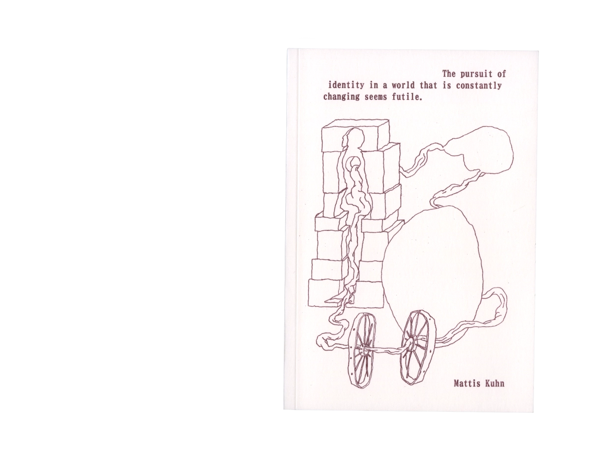

<br>

```{margin}
Mattis Kuhn: The pursuit of identity in a world that is constantly changing seems futile. (2025)
```
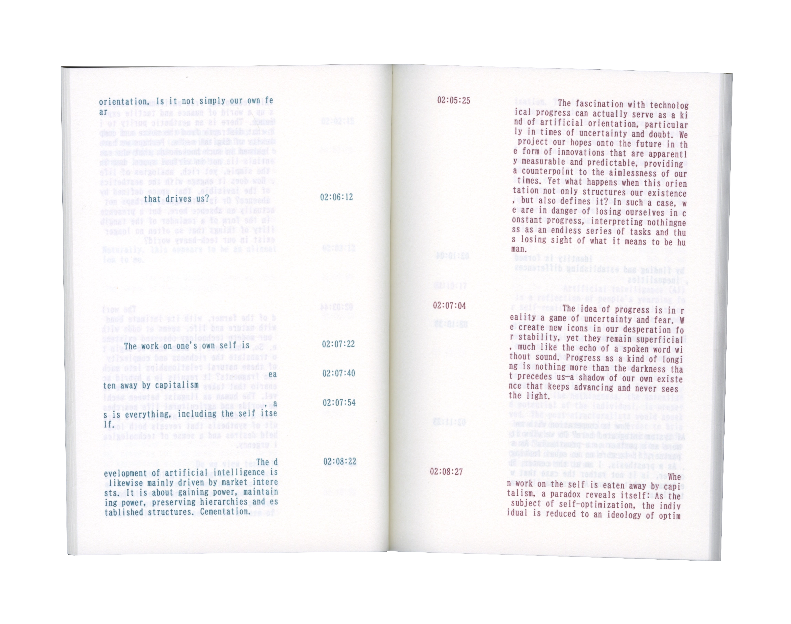

<br>

---

## Overviews & History

### [35 Year History of ChatGPT — ColdFusion (2023)](https://www.youtube.com/watch?v=OFS90-FX6pg)
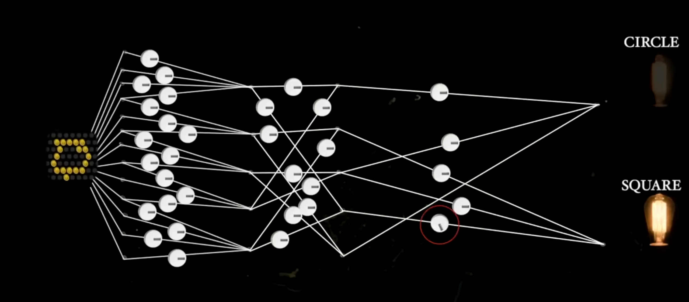

### [Large Language Models Explained Briefly — 3Blue1Brown (2024)](https://www.youtube.com/watch?v=LPZh9BOjkQs)
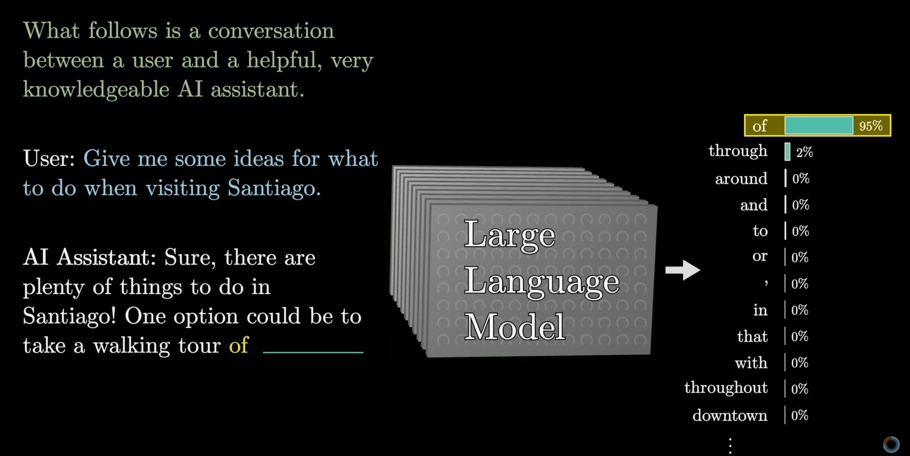

---

## Research

### [Finding Structure in Time — Jeffrey L. Elman (1990)](https://jontallen.ece.illinois.edu/Public/Elman-FindingStructureinTime.90.pdf)
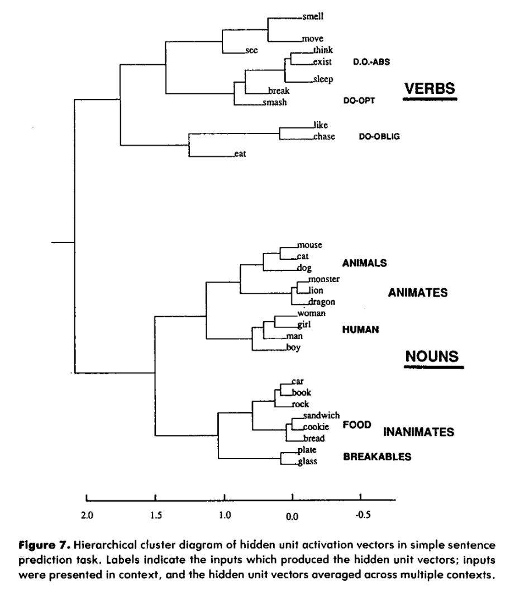

### [Unsupervised Sentiment Neuron — OpenAI (Alec Radford et al., 2017)](https://openai.com/index/unsupervised-sentiment-neuron/)
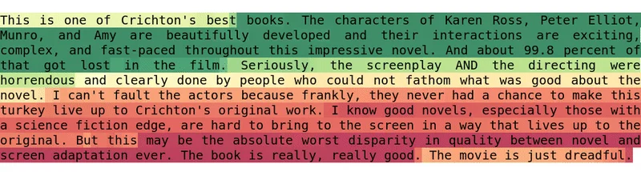

### [»Attention is All You Need« — Vaswani et al. (2017)](https://arxiv.org/abs/1706.03762)  
[Wikipedia Summary](https://en.wikipedia.org/wiki/Attention_Is_All_You_Need)
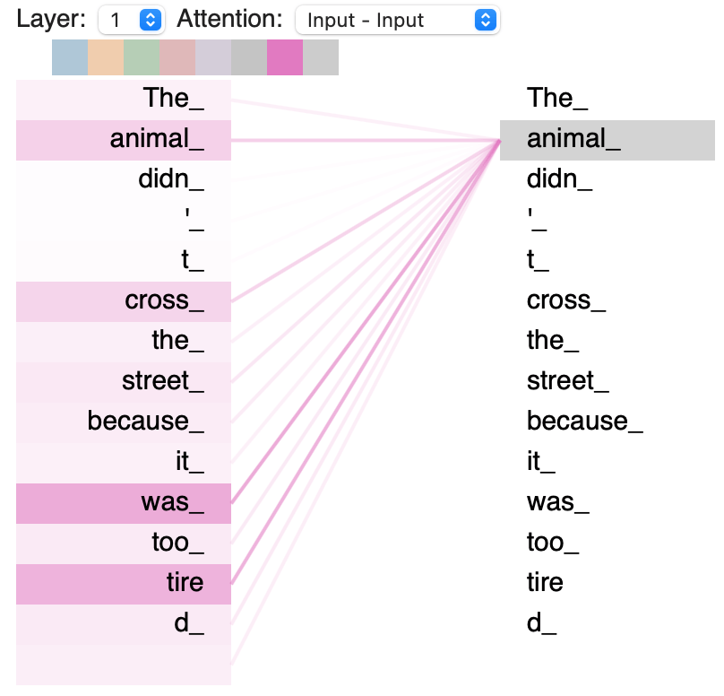

---

## Visualizations

### [Transformer Explainer — Polo Club of Data Science (2024)](https://poloclub.github.io/transformer-explainer/)
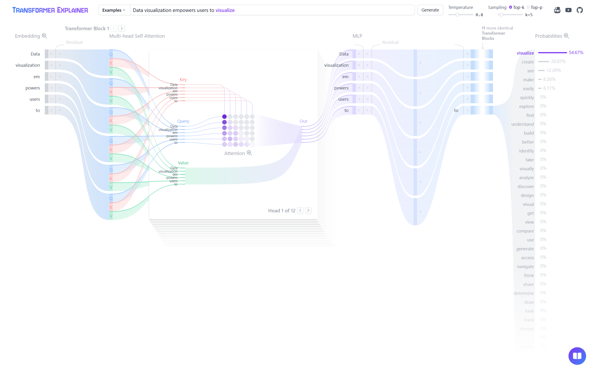

### [LLM Visualizer — Ben Bycroft (2022)](https://bbycroft.net/llm)
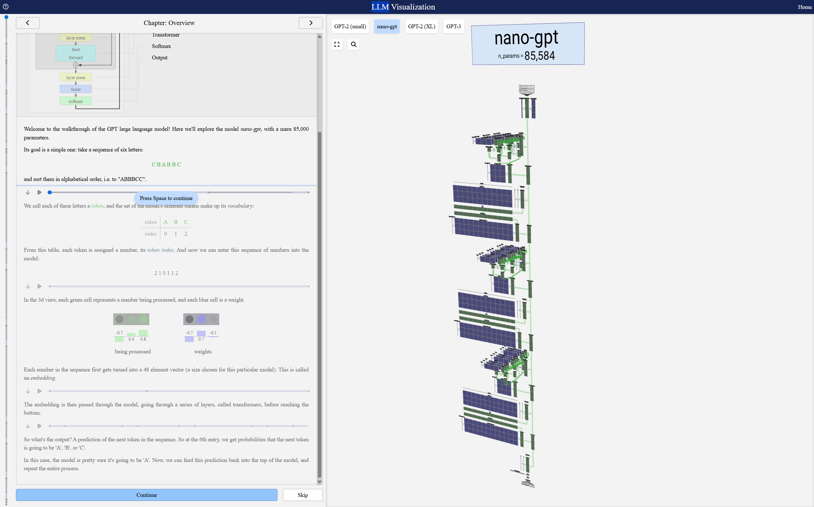
