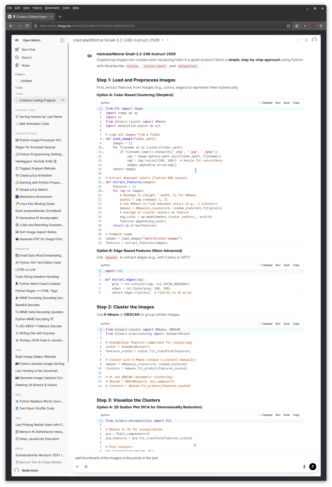
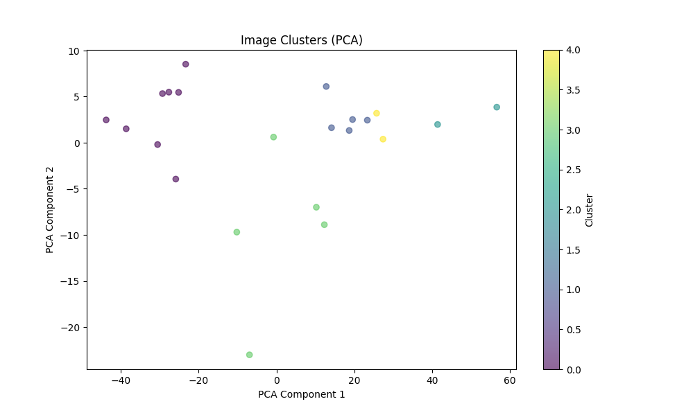
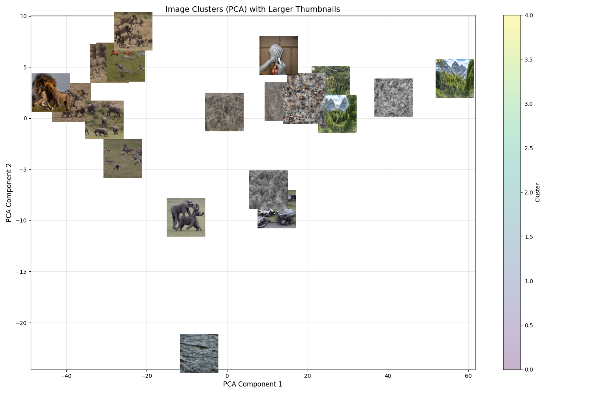
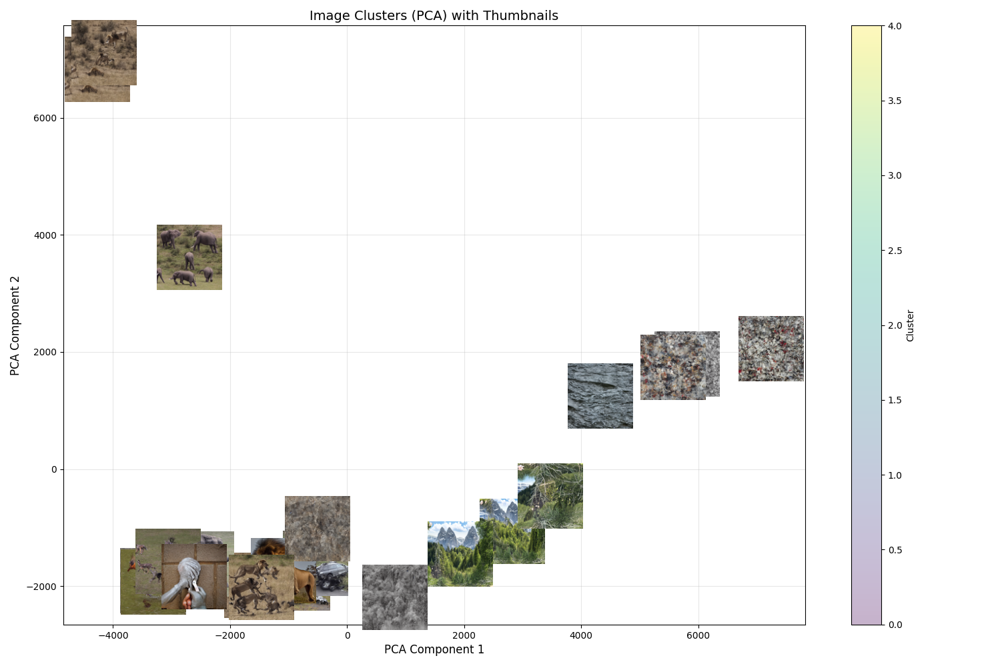

# Coding Exercise

Imagine a small coding project, that you will realize together with AI. 

Recommendation: 
- If you have found a project you're going to realize, create a new folder and open it with VSCode/VSCodium. 
- It's likely that you need to install some libraries for your project. If it's a Python project, activate your environment first (or create a new one) before installing libraries.

If nothing comes to your mind, ask the Chatbot for a list of small creative coding projects for beginners, using Python or JavaScript.

You can try to work with your own data. For example 

- visualizing
- sorting
- analyzing

Or ask the chatbot what you may do with the data.

When you start a project, it can be helpfull to discuss it with the chatbot first. For example 

> I have a folder full of images and I want to organize them into clusters. Then I want to visualize these. What are simple approaches using Python?

(It can be helpful to add the path to the folder, so that it will be included into the generated code. Otherwise you have to change it manually.)

Probably this will give you some options and code snippets. Pick one of them and ask for the full code.



> Write me working code for Option A.

```python

import os
import numpy as np
from PIL import Image
from sklearn.cluster import KMeans
from sklearn.decomposition import PCA
from sklearn.preprocessing import StandardScaler
import matplotlib.pyplot as plt
import shutil

# --- Step 1: Load and Preprocess Images ---
def load_images(folder_path, target_size=(100, 100)):
    images = []
    filenames = []
    for filename in os.listdir(folder_path):
        if filename.lower().endswith(('.png', '.jpg', '.jpeg')):
            img_path = os.path.join(folder_path, filename)
            img = Image.open(img_path).convert('RGB')  # Ensure RGB
            img = img.resize(target_size)  # Resize for consistency
            images.append(np.array(img))
            filenames.append(filename)
    return images, filenames

# --- Step 2: Extract Dominant Colors (Features) ---
def extract_features(images, n_colors=5):
    features = []
    for img in images:
        # Reshape to (height * width, 3) for KMeans
        pixels = img.reshape(-1, 3)
        # Use KMeans to find dominant colors
        kmeans = KMeans(n_clusters=n_colors, random_state=42).fit(pixels)
        # Average of cluster centers as feature
        avg_color = np.mean(kmeans.cluster_centers_, axis=0)
        features.append(avg_color)
    return np.array(features)

# --- Step 3: Cluster Images ---
def cluster_images(features, n_clusters=5):
    # Standardize features (important for clustering)
    scaler = StandardScaler()
    features_scaled = scaler.fit_transform(features)
    # Cluster with K-Means
    kmeans = KMeans(n_clusters=n_clusters, random_state=42)
    clusters = kmeans.fit_predict(features_scaled)
    return clusters

# --- Step 4: Visualize Clusters ---
def visualize_clusters(features, clusters):
    # Reduce to 2D for visualization
    pca = PCA(n_components=2)
    pca_features = pca.fit_transform(features)

    plt.figure(figsize=(10, 6))
    scatter = plt.scatter(pca_features[:, 0], pca_features[:, 1], c=clusters, cmap='viridis', alpha=0.6)
    plt.colorbar(scatter, label='Cluster')
    plt.title("Image Clusters (PCA)")
    plt.xlabel("PCA Component 1")
    plt.ylabel("PCA Component 2")
    plt.show()

# --- Step 5: Save Clustered Images to Folders ---
def save_clustered_images(images, filenames, clusters, output_dir="clustered_images"):
    os.makedirs(output_dir, exist_ok=True)
    for cluster_id in set(clusters):
        cluster_dir = os.path.join(output_dir, f"cluster_{cluster_id}")
        os.makedirs(cluster_dir, exist_ok=True)

    for i, (img, filename) in enumerate(zip(images, filenames)):
        cluster_id = clusters[i]
        cluster_dir = os.path.join(output_dir, f"cluster_{cluster_id}")
        dst_path = os.path.join(cluster_dir, filename)
        # Save the image (convert numpy array to PIL Image)
        Image.fromarray(img).save(dst_path)

# --- Main Workflow ---
if __name__ == "__main__":
    # 1. Load images
    folder_path = "path/to/your/images"  # Replace with your folder path
    images, filenames = load_images(folder_path)

    # 2. Extract features (dominant colors)
    features = extract_features(images, n_colors=5)

    # 3. Cluster images
    clusters = cluster_images(features, n_clusters=5)

    # 4. Visualize clusters
    visualize_clusters(features, clusters)

    # 5. Save clustered images
    save_clustered_images(images, filenames, clusters)
    print("Images clustered and saved to 'clustered_images/' folder!")
```



> Add thumbnails of the images to the points in the plot

```python
import os
import numpy as np
from PIL import Image
from sklearn.cluster import KMeans
from sklearn.decomposition import PCA
from sklearn.preprocessing import StandardScaler
import matplotlib.pyplot as plt
from matplotlib.offsetbox import OffsetImage, AnnotationBbox
import shutil

# --- Step 1: Load and Preprocess Images ---
def load_images(folder_path, target_size=(100, 100)):
    images = []
    filenames = []
    for filename in os.listdir(folder_path):
        if filename.lower().endswith(('.png', '.jpg', '.jpeg')):
            img_path = os.path.join(folder_path, filename)
            img = Image.open(img_path).convert('RGB')  # Ensure RGB
            img = img.resize(target_size)  # Resize for consistency
            images.append(np.array(img))
            filenames.append(filename)
    return images, filenames

# --- Step 2: Extract Dominant Colors (Features) ---
def extract_features(images, n_colors=5):
    features = []
    for img in images:
        pixels = img.reshape(-1, 3)
        kmeans = KMeans(n_clusters=n_colors, random_state=42).fit(pixels)
        avg_color = np.mean(kmeans.cluster_centers_, axis=0)
        features.append(avg_color)
    return np.array(features)

# --- Step 3: Cluster Images ---
def cluster_images(features, n_clusters=5):
    scaler = StandardScaler()
    features_scaled = scaler.fit_transform(features)
    kmeans = KMeans(n_clusters=n_clusters, random_state=42)
    clusters = kmeans.fit_predict(features_scaled)
    return clusters

# --- Step 4: Visualize Clusters with Thumbnails ---
def visualize_clusters_with_thumbnails(images, features, clusters, filenames):
    pca = PCA(n_components=2)
    pca_features = pca.fit_transform(features)

    fig, ax = plt.subplots(figsize=(12, 8))

    # Create a thumbnail for each image
    for i, (x, y) in enumerate(pca_features):
        # Resize image for thumbnail
        thumbnail = Image.fromarray(images[i])
        thumbnail.thumbnail((50, 50))  # Resize to 50x50 pixels

        # Create an OffsetImage for the thumbnail
        imagebox = OffsetImage(thumbnail, zoom=0.5, cmap='gray')
        ab = AnnotationBbox(
            imagebox,
            (x, y),
            frameon=False,
            box_alignment=(0.5, 0.5),
            xycoords='data',
            pad=0.1
        )
        ax.add_artist(ab)

    # Add cluster labels
    scatter = ax.scatter(
        pca_features[:, 0],
        pca_features[:, 1],
        c=clusters,
        cmap='viridis',
        alpha=0.3,
        s=50  # Small dots to indicate cluster centers
    )
    plt.colorbar(scatter, label='Cluster')
    plt.title("Image Clusters (PCA) with Thumbnails")
    plt.xlabel("PCA Component 1")
    plt.ylabel("PCA Component 2")
    plt.grid(True, alpha=0.3)
    plt.tight_layout()
    plt.show()

# --- Step 5: Save Clustered Images to Folders ---
def save_clustered_images(images, filenames, clusters, output_dir="clustered_images"):
    os.makedirs(output_dir, exist_ok=True)
    for cluster_id in set(clusters):
        cluster_dir = os.path.join(output_dir, f"cluster_{cluster_id}")
        os.makedirs(cluster_dir, exist_ok=True)

    for i, (img, filename) in enumerate(zip(images, filenames)):
        cluster_id = clusters[i]
        cluster_dir = os.path.join(output_dir, f"cluster_{cluster_id}")
        dst_path = os.path.join(cluster_dir, filename)
        Image.fromarray(img).save(dst_path)

# --- Main Workflow ---
if __name__ == "__main__":
    folder_path = "path/to/your/images"  # Replace with your folder path
    images, filenames = load_images(folder_path)
    features = extract_features(images, n_colors=5)
    clusters = cluster_images(features, n_clusters=5)

    # Visualize with thumbnails
    visualize_clusters_with_thumbnails(images, features, clusters, filenames)

    # Save clustered images
    save_clustered_images(images, filenames, clusters)
    print("Images clustered and saved to 'clustered_images/' folder!")
```



> Double the size of the thumbnails.
 
(Or try to figure it out without the chatbot.)

```python
import os
import numpy as np
from PIL import Image
from sklearn.cluster import KMeans
from sklearn.decomposition import PCA
from sklearn.preprocessing import StandardScaler
import matplotlib.pyplot as plt
from matplotlib.offsetbox import OffsetImage, AnnotationBbox
import shutil

# --- Step 1: Load and Preprocess Images ---
def load_images(folder_path, target_size=(100, 100)):
    images = []
    filenames = []
    for filename in os.listdir(folder_path):
        if filename.lower().endswith(('.png', '.jpg', '.jpeg')):
            img_path = os.path.join(folder_path, filename)
            img = Image.open(img_path).convert('RGB')  # Ensure RGB
            img = img.resize(target_size)  # Resize for consistency
            images.append(np.array(img))
            filenames.append(filename)
    return images, filenames

# --- Step 2: Extract Dominant Colors (Features) ---
def extract_features(images, n_colors=5):
    features = []
    for img in images:
        pixels = img.reshape(-1, 3)
        kmeans = KMeans(n_clusters=n_colors, random_state=42).fit(pixels)
        avg_color = np.mean(kmeans.cluster_centers_, axis=0)
        features.append(avg_color)
    return np.array(features)

# --- Step 3: Cluster Images ---
def cluster_images(features, n_clusters=5):
    scaler = StandardScaler()
    features_scaled = scaler.fit_transform(features)
    kmeans = KMeans(n_clusters=n_clusters, random_state=42)
    clusters = kmeans.fit_predict(features_scaled)
    return clusters

# --- Step 4: Visualize Clusters with Larger Thumbnails ---
def visualize_clusters_with_thumbnails(images, features, clusters, filenames):
    pca = PCA(n_components=2)
    pca_features = pca.fit_transform(features)

    fig, ax = plt.subplots(figsize=(15, 10))  # Larger figure to fit thumbnails

    # Create a thumbnail for each image (now 100x100 pixels)
    for i, (x, y) in enumerate(pca_features):
        thumbnail = Image.fromarray(images[i])
        thumbnail.thumbnail((100, 100))  # Double the size (100x100)

        imagebox = OffsetImage(thumbnail, zoom=0.7, cmap='gray')  # Increased zoom
        ab = AnnotationBbox(
            imagebox,
            (x, y),
            frameon=False,
            box_alignment=(0.5, 0.5),
            xycoords='data',
            pad=0.3  # Slightly more padding
        )
        ax.add_artist(ab)

    # Add cluster labels
    scatter = ax.scatter(
        pca_features[:, 0],
        pca_features[:, 1],
        c=clusters,
        cmap='viridis',
        alpha=0.3,
        s=100  # Larger dots for cluster centers
    )
    plt.colorbar(scatter, label='Cluster')
    plt.title("Image Clusters (PCA) with Larger Thumbnails", fontsize=14)
    plt.xlabel("PCA Component 1", fontsize=12)
    plt.ylabel("PCA Component 2", fontsize=12)
    plt.grid(True, alpha=0.3)
    plt.tight_layout()
    plt.show()

# --- Step 5: Save Clustered Images to Folders ---
def save_clustered_images(images, filenames, clusters, output_dir="clustered_images"):
    os.makedirs(output_dir, exist_ok=True)
    for cluster_id in set(clusters):
        cluster_dir = os.path.join(output_dir, f"cluster_{cluster_id}")
        os.makedirs(cluster_dir, exist_ok=True)

    for i, (img, filename) in enumerate(zip(images, filenames)):
        cluster_id = clusters[i]
        cluster_dir = os.path.join(output_dir, f"cluster_{cluster_id}")
        dst_path = os.path.join(cluster_dir, filename)
        Image.fromarray(img).save(dst_path)

# --- Main Workflow ---
if __name__ == "__main__":
    folder_path = "path/to/your/images"  # Replace with your folder path
    images, filenames = load_images(folder_path)
    features = extract_features(images, n_colors=5)
    clusters = cluster_images(features, n_clusters=5)

    # Visualize with larger thumbnails
    visualize_clusters_with_thumbnails(images, features, clusters, filenames)

    # Save clustered images
    save_clustered_images(images, filenames, clusters)
    print("Images clustered and saved to 'clustered_images/' folder!")
```


> Keep the code but replace the color-based clustering by the more advanced edge-based features clustering with Canny or SIFT.

```python
import os
import numpy as np
from PIL import Image
import cv2
from sklearn.cluster import KMeans
from sklearn.decomposition import PCA
from sklearn.preprocessing import StandardScaler
import matplotlib.pyplot as plt
from matplotlib.offsetbox import OffsetImage, AnnotationBbox
import shutil

# --- Step 1: Load and Preprocess Images ---
def load_images(folder_path, target_size=(100, 100)):
    images = []
    filenames = []
    for filename in os.listdir(folder_path):
        if filename.lower().endswith(('.png', '.jpg', '.jpeg')):
            img_path = os.path.join(folder_path, filename)
            img = Image.open(img_path).convert('RGB')
            img = img.resize(target_size)
            images.append(np.array(img))
            filenames.append(filename)
    return images, filenames

# --- Step 2: Extract Edge Features (Canny or SIFT) ---
def extract_edge_features(images, method='canny'):
    features = []
    for img in images:
        gray = cv2.cvtColor(img, cv2.COLOR_RGB2GRAY)

        if method == 'canny':
            # Canny edge detection (simpler)
            edges = cv2.Canny(gray, 100, 200)
            feature = edges.flatten()  # Flatten to 1D array
        elif method == 'sift':
            # SIFT keypoints (more advanced)
            sift = cv2.SIFT_create()
            _, des = sift.detectAndCompute(gray, None)
            if des is not None:
                feature = np.mean(des, axis=0)  # Average descriptor
            else:
                feature = np.zeros(128)  # Fallback if no keypoints
        else:
            raise ValueError("Method must be 'canny' or 'sift'")

        features.append(feature)
    return np.array(features)

# --- Step 3: Cluster Images ---
def cluster_images(features, n_clusters=5):
    scaler = StandardScaler()
    features_scaled = scaler.fit_transform(features)
    kmeans = KMeans(n_clusters=n_clusters, random_state=42)
    clusters = kmeans.fit_predict(features_scaled)
    return clusters

# --- Step 4: Visualize Clusters with Thumbnails ---
def visualize_clusters_with_thumbnails(images, features, clusters, filenames):
    pca = PCA(n_components=2)
    pca_features = pca.fit_transform(features)

    fig, ax = plt.subplots(figsize=(15, 10))

    for i, (x, y) in enumerate(pca_features):
        thumbnail = Image.fromarray(images[i])
        thumbnail.thumbnail((100, 100))

        imagebox = OffsetImage(thumbnail, zoom=0.7, cmap='gray')
        ab = AnnotationBbox(
            imagebox,
            (x, y),
            frameon=False,
            box_alignment=(0.5, 0.5),
            xycoords='data',
            pad=0.3
        )
        ax.add_artist(ab)

    scatter = ax.scatter(
        pca_features[:, 0],
        pca_features[:, 1],
        c=clusters,
        cmap='viridis',
        alpha=0.3,
        s=100
    )
    plt.colorbar(scatter, label='Cluster')
    plt.title("Image Clusters (PCA) with Thumbnails", fontsize=14)
    plt.xlabel("PCA Component 1", fontsize=12)
    plt.ylabel("PCA Component 2", fontsize=12)
    plt.grid(True, alpha=0.3)
    plt.tight_layout()
    plt.show()

# --- Step 5: Save Clustered Images to Folders ---
def save_clustered_images(images, filenames, clusters, output_dir="clustered_images"):
    os.makedirs(output_dir, exist_ok=True)
    for cluster_id in set(clusters):
        cluster_dir = os.path.join(output_dir, f"cluster_{cluster_id}")
        os.makedirs(cluster_dir, exist_ok=True)

    for i, (img, filename) in enumerate(zip(images, filenames)):
        cluster_id = clusters[i]
        cluster_dir = os.path.join(output_dir, f"cluster_{cluster_id}")
        dst_path = os.path.join(cluster_dir, filename)
        Image.fromarray(img).save(dst_path)

# --- Main Workflow ---
if __name__ == "__main__":
    folder_path = "path/to/your/images"  # Replace with your folder path
    images, filenames = load_images(folder_path)

    # Choose feature extraction method: 'canny' (default) or 'sift'
    method = 'canny'  # Change to 'sift' for SIFT features
    features = extract_edge_features(images, method=method)

    clusters = cluster_images(features, n_clusters=5)

    # Visualize with thumbnails
    visualize_clusters_with_thumbnails(images, features, clusters, filenames)

    # Save clustered images
    save_clustered_images(images, filenames, clusters)
    print(f"Images clustered using {method} edges and saved to 'clustered_images/' folder!")
```

