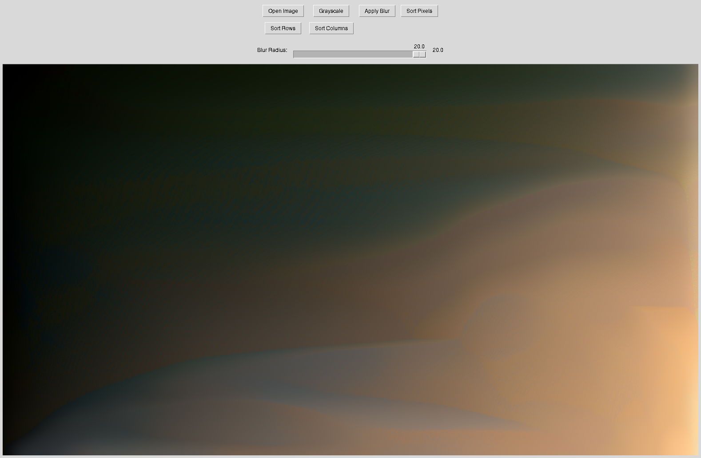

# Python GUI for Image Processing

Use your favorite LLM-System to write a python GUI that performs actions like 

- load an image
- display the image
- convert it to grayscale
- sort it by color, hue, etc.
- ...

Below is an example with code.



```python
import tkinter as tk
from tkinter import filedialog, Scale
from PIL import Image, ImageTk, ImageFilter
import numpy as np

class ImageProcessorApp:
    def __init__(self, root):
        self.root = root
        self.root.title("Image Processor")
        self.root.geometry("900x650")  # Increased height for the slider
        
        # Create a frame for buttons
        self.button_frame = tk.Frame(root)
        self.button_frame.pack(pady=5)
        
        # Create buttons
        self.open_button = tk.Button(self.button_frame, text="Open Image", command=self.open_image)
        self.grayscale_button = tk.Button(self.button_frame, text="Grayscale", command=self.apply_grayscale)
        self.blur_button = tk.Button(self.button_frame, text="Apply Blur", command=self.apply_blur)
        self.sort_button = tk.Button(self.button_frame, text="Sort Pixels", command=self.apply_sort)
        self.sort_row_button = tk.Button(self.button_frame, text="Sort Rows", command=self.apply_row_sort)
        self.sort_column_button = tk.Button(self.button_frame, text="Sort Columns", command=self.apply_column_sort)
        
        # Layout buttons in two rows to prevent overcrowding
        self.open_button.grid(row=0, column=0, padx=5, pady=5)
        self.grayscale_button.grid(row=0, column=1, padx=5, pady=5)
        self.blur_button.grid(row=0, column=2, padx=5, pady=5)
        self.sort_button.grid(row=0, column=3, padx=5, pady=5)
        self.sort_row_button.grid(row=1, column=0, padx=5, pady=5)
        self.sort_column_button.grid(row=1, column=1, padx=5, pady=5)
        
        # Create a frame for the blur slider
        self.slider_frame = tk.Frame(root)
        self.slider_frame.pack(pady=5)
        
        # Create blur radius slider
        self.blur_label = tk.Label(self.slider_frame, text="Blur Radius:")
        self.blur_label.grid(row=0, column=0, padx=5)
        
        self.blur_slider = Scale(self.slider_frame, from_=0, to=20, orient=tk.HORIZONTAL, 
                                length=300, resolution=0.5, command=self.on_slider_change)
        self.blur_slider.set(2)  # Default value
        self.blur_slider.grid(row=0, column=1, padx=5)
        
        # Create a label to show current blur value
        self.blur_value_label = tk.Label(self.slider_frame, text="2.0")
        self.blur_value_label.grid(row=0, column=2, padx=5)
        
        # Create a frame for the canvas with resizing capability
        self.canvas_frame = tk.Frame(root)
        self.canvas_frame.pack(fill=tk.BOTH, expand=True, padx=5, pady=5)
        
        # Create canvas for image display
        self.canvas = tk.Canvas(self.canvas_frame, bg="gray")
        self.canvas.pack(fill=tk.BOTH, expand=True)
        
        # Bind the canvas resize event
        self.canvas.bind("<Configure>", self.on_canvas_resize)
        
        # Initialize image variables
        self.original_image = None
        self.current_image = None
        self.tk_image = None
        self.display_image_obj = None
        
    def on_slider_change(self, value):
        # Update the blur value label when slider changes
        self.blur_value_label.config(text=f"{float(value):.1f}")
        
    def on_canvas_resize(self, event):
        # Redisplay the image when the canvas is resized
        if self.current_image:
            self.display_image(self.current_image)
    
    def open_image(self):
        file_path = filedialog.askopenfilename(
            filetypes=[("Image files", "*.jpg *.jpeg *.png *.bmp *.gif *.tiff")]
        )
        if file_path:
            self.original_image = Image.open(file_path)
            self.current_image = self.original_image.copy()
            self.display_image(self.current_image)
    
    def display_image(self, image):
        # Get current canvas dimensions
        canvas_width = self.canvas.winfo_width()
        canvas_height = self.canvas.winfo_height()
        
        # Skip if canvas is too small
        if canvas_width <= 1 or canvas_height <= 1:
            return
            
        # Calculate aspect ratio
        img_width, img_height = image.size
        ratio = min(canvas_width/img_width, canvas_height/img_height)
        new_size = (int(img_width * ratio), int(img_height * ratio))
        
        # Resize the image for display
        display_image = image.resize(new_size, Image.Resampling.LANCZOS)
        self.display_image_obj = ImageTk.PhotoImage(display_image)
        
        # Clear canvas and display image
        self.canvas.delete("all")
        self.canvas.create_image(
            canvas_width//2, 
            canvas_height//2, 
            anchor=tk.CENTER, 
            image=self.display_image_obj
        )
    
    def apply_grayscale(self):
        if self.current_image:
            grayscale_image = self.image_to_grayscale(self.current_image)
            self.current_image = grayscale_image
            self.display_image(self.current_image)
    
    def image_to_grayscale(self, image):
        # Convert image to grayscale
        if image.mode != 'L':
            return image.convert('L')
        return image
    
    def apply_blur(self):
        if self.current_image:
            # Get the current blur radius from the slider
            blur_radius = self.blur_slider.get()
            blurred_image = self.image_gaussian_blur(self.current_image, radius=blur_radius)
            self.current_image = blurred_image
            self.display_image(self.current_image)
    
    def image_gaussian_blur(self, image, radius=2):
        # Apply Gaussian blur to the image
        return image.filter(ImageFilter.GaussianBlur(radius=radius))
    
    def apply_sort(self):
        if self.current_image:
            sorted_image = self.image_sorted(self.current_image)
            self.current_image = sorted_image
            self.display_image(self.current_image)
    
    def image_sorted(self, image):
        # Convert image to RGB if it's not already
        if image.mode != 'RGB':
            image = image.convert('RGB')
        
        # Convert to numpy array
        img_array = np.array(image)
        height, width, channels = img_array.shape
        
        # Flatten the image array and sort by a specific criterion
        # Here we'll sort by the sum of RGB values (brightness)
        flattened = img_array.reshape(-1, channels)
        
        # Calculate brightness for each pixel
        brightness = np.sum(flattened, axis=1)
        
        # Sort pixels by brightness
        sorted_indices = np.argsort(brightness)
        sorted_pixels = flattened[sorted_indices]
        
        # Reshape back to original image dimensions
        sorted_array = sorted_pixels.reshape(height, width, channels)
        
        # Convert back to PIL Image
        return Image.fromarray(sorted_array.astype('uint8'))
    
    def apply_row_sort(self):
        if self.current_image:
            row_sorted_image = self.image_sorted_row(self.current_image)
            self.current_image = row_sorted_image
            self.display_image(self.current_image)
    
    def image_sorted_row(self, image):
        # Convert image to RGB if it's not already
        if image.mode != 'RGB':
            image = image.convert('RGB')
        
        # Convert to numpy array
        img_array = np.array(image)
        height, width, channels = img_array.shape
        
        # Process each row individually
        for i in range(height):
            # Get the current row
            row = img_array[i, :, :]
            
            # Calculate brightness for each pixel in the row
            brightness = np.sum(row, axis=1)
            
            # Sort the row by brightness
            sorted_indices = np.argsort(brightness)
            sorted_row = row[sorted_indices]
            
            # Put the sorted row back
            img_array[i, :, :] = sorted_row
        
        # Convert back to PIL Image
        return Image.fromarray(img_array.astype('uint8'))
    
    def apply_column_sort(self):
        if self.current_image:
            column_sorted_image = self.image_sorted_column(self.current_image)
            self.current_image = column_sorted_image
            self.display_image(self.current_image)
    
    def image_sorted_column(self, image):
        # Convert image to RGB if it's not already
        if image.mode != 'RGB':
            image = image.convert('RGB')
        
        # Convert to numpy array
        img_array = np.array(image)
        height, width, channels = img_array.shape
        
        # Process each column individually
        for j in range(width):
            # Get the current column
            column = img_array[:, j, :]
            
            # Calculate brightness for each pixel in the column
            brightness = np.sum(column, axis=1)
            
            # Sort the column by brightness
            sorted_indices = np.argsort(brightness)
            sorted_column = column[sorted_indices]
            
            # Put the sorted column back
            img_array[:, j, :] = sorted_column
        
        # Convert back to PIL Image
        return Image.fromarray(img_array.astype('uint8'))

if __name__ == "__main__":
    root = tk.Tk()
    app = ImageProcessorApp(root)
    root.mainloop()
```