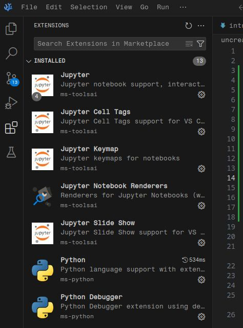

# Setup environment

## Code Editor 

We'll work with VSCode / VSCodium:

[VSCode](https://code.visualstudio.com/) — VSCode developed by Microsoft

[VSCodium](https://vscodium.com/) — VSCode without tracking and telemetry

### Extensions

After installation, go to the `Extensions`-tab and install the following extensions:

- Python 
- Jupyter 
- Live Server



## Virtual environment

It is recommended to create a virtual environment for your project/ setup. All the libraries and dependencies installed for this project are isolated and won't conflict other libraries and their dependencies. The easiest way to create a virtual environment is **conda**.

### Miniconda

[Download](https://www.anaconda.com/download/success#miniconda) Miniconda for your OS and execute the installer. 

Open the Terminal inside VSCode: `Terminal` -> `New Terminal` and type the following commands, line by line, execute each one of them with pressing `Enter`.

``` shell
# check if conda is installed
conda --version
```

### Create a new environment

``` shell
# create a new environment called "up" with Python version 3.12
conda create -n handsonai python=3.12 -y
```

The word after the `-n` flag (in this case "up") is the name of your environment and you have to type it when you start it later on, so make sure it's not too long and easy to remember.


You can see all environments created by you with the following command:

```shell
# list available environments
conda env list
```

Next we can activate our newly created environment.

```shell
# activate your environment
conda activate handsonai
```

### Install external packages with pip

We can use Python's package installer **pip** to install external libraries like [numpy](https://pypi.org/project/numpy/).

```shell
# important: activate your environment first
conda activate handsonai

# install the library nuumpy with pip
pip install numpy
```

### Deactivate conda

When we've finished our work, we can deactivate the environment with:

```shell
# deactivate environment
conda deactivate
```

### Remove an environment

```shell
conda remove -n <my environment> --all
```

## Python

[Python](https://www.python.org/) is an easy to write general purpose programming language, meaning it can be used for a variety of different applications.

### Scripting language

Python is a [scripting language](https://www.wikiwand.com/en/Scripting_language). Code written in Python is interpreted on the fly, instead of compiled into a piece of software beforehand.
Python can be used to write stand-alone software, but (as other scripting languages) it can also be used to extend the functionality of existing software.

For example Python scripts can extend 

- Blender
- Grasshopper
- GIMP
- FontForge
- Glyphs

## Terminal 

As a scripting language Python can be used inside the console/terminal (Command Line Interface) of your OS in an **interactive** mode: type a line of code, press Enter and it's interpreted.

```
~$ python                                                                                  
>>> import random
>>> l = ['apple', 'banana', 'python']                               
>>> random.choice(l)
```

(The `$` is an indicator for code that's written in the CLI. If you see `>>>` before Python code, this means that it's written in an interactive session.)

Code is nothing else then plain text. Let's save it as a file.

`hello.py`
```python
name = input('What is your name?\n')
print(f'Hello {name}!')
```

We can execute an openend file inside VSCode with the `Play`-Button.


We'll see the results inside the Terminal below.

## Appendix

### Terminal emulators 

Here are some terminal emulators (beyond the default one of your OS):

**Cross Platform**

[Alacritty](https://alacritty.org/)

[Kitty](https://sw.kovidgoyal.net/kitty/)

[Tabby](https://tabby.sh/) 

**Linux**

[Terminator](https://gnome-terminator.org/)

[Konsole](https://konsole.kde.org/)

**Mac**

[iTerm2](https://iterm2.com/)
