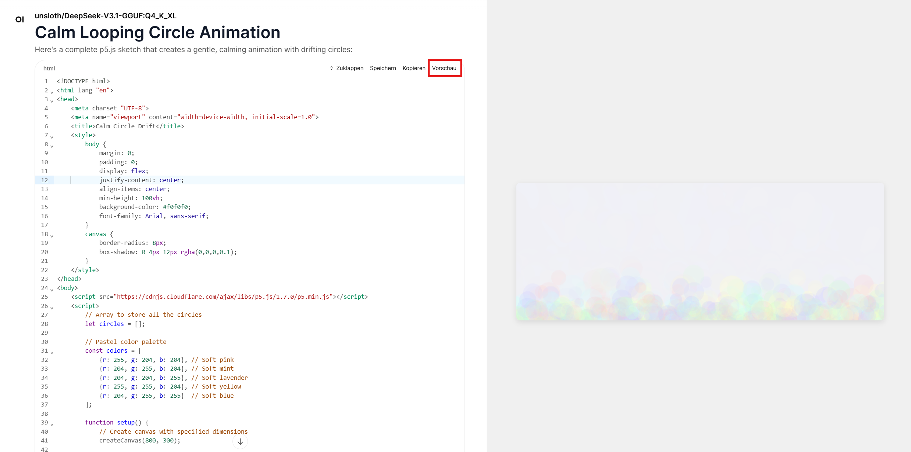

# How to prompt for code

[p5.js](https://p5js.org/) is a creative coding library that makes it easy to draw shapes, create animations, and make interactive artworks directly in the browser.  
You don’t need any coding experience — all you need is a good *prompt*. With a clear description, you can ask a chat assistant to generate a full working sketch for you.

Prompts can be **structured**: instead of writing everything in one sentence, you can divide your request into small parts — an **intro**, some **details**, and **constraints** about how the code should be returned. This helps the assistant understand what you want and gives you more predictable results.

The goal here is to create a **small sketch or animation using p5.js only through prompting** — no manual coding. Below is an example of how such a structured prompt could look, followed by what the generated sketch might produce.

---

## Example — Minimal Prompt

> **Intro**  
> I want a p5.js sketch that follows this description:
> 
> **Sketch details:**  
> - A calm, looping background animation for a website header  
> - Canvas: 800×300 pixels  
> - Soft pastel circles drifting upward, growing, fading, and respawning  
> - On click: small burst of circles at the mouse position  
> - Random size (10–40 px), smooth movement for a gentle, organic feel
> 
> **Output:**  
> Use only p5.js, keep the code simple and well-commented.  
> Give me the full HTML file with p5.js via CDN and all code in one `<script>` tag.

---

### Example result

---

## Ideas for what to prompt for

You can think of your prompt like giving directions to an artist. Try specifying:

- **Shapes:** “Use rectangles,” “draw curved lines,” “a grid of circles,” “random triangles.”  
- **Background:** “Set a gradient background,” “use a dark background with glowing lines.”  
- **Interaction:** “When I click, spawn new shapes,” “move objects with the mouse,” “change color when pressing a key.”  
- **Style:** “Minimalist,” “retro pixel art,” “dreamy watercolor feel,” “neon glowing lines.”  
- **Motion:** “Objects orbit around a point,” “wave-like motion,” “smooth easing between positions.”  

Start simple, and then add one or two new ideas each time you prompt — the assistant can build on previous results or modify parts of the code.

---

## How to continue

After you receive your sketch:

- You can **download the generated HTML file** and open it in your browser to see it run.  
- You can also **ask the chatbot to explain the code**, line by line or section by section, to learn how it works.  
- Try modifying your prompt: ask for different colors, shapes, or behaviors to see how the code changes.

Prompting for p5 sketches is a playful way to learn creative coding — one description at a time.
