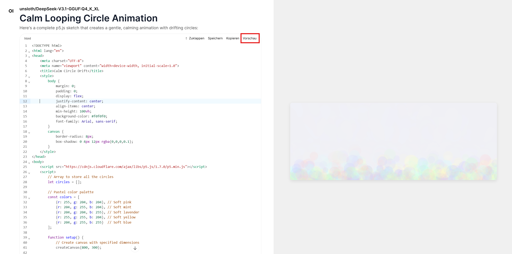

# How to prompt for code

[p5.js](https://p5js.org/) is a creative coding library that makes it easy to draw shapes, create animations, and make interactive artworks directly in the browser.  
You don’t need any coding experience – all you need is a good *prompt*. With a clear description, you can ask a chat assistant to generate a full working sketch for you.

We will use one of several available **chat services** that can generate code from text prompts.

---

## Chat services you can use

Below are several free or open chat platforms that work well for generating p5.js sketches:

- [**chat1**](https://chat1.kitegg.de/) – Collection of open models running on the [KITeGG](https://gestaltung.ai/de)-Cluster in Mainz.  
- [**Duck.ai**](https://duck.ai/) – Conversations with 3rd-party AI chat models, anonymized by DuckDuckGo.  
- [**ChatGPT Free (OpenAI)**](https://chat.openai.com/) – Based on GPT-3.5, accessible via web.  
- [**Mistral / Le Chat**](https://chat.mistral.ai/) – Lightweight, open-weight model with web interface.  
- [**Perplexity.ai**](https://Perplexity.ai) – AI research assistant with live web access.  
- [**DeepSeek Chat**](https://chat.deepseek.com/)* – Open, high-quality large language model.  
- [**Claude.ai (Anthropic)**](https://claude.ai/)* – Ethical, reasoning-focused LLM by Anthropic.

*requires registration

---

## What p5.js can do

p5.js runs entirely in your web browser and is designed for **visual, interactive sketches**.  
You can draw **basic shapes** (circles, rectangles, lines, polygons), add **text**, control **color and motion**, and respond to **mouse or keyboard input**.

It is *not* a video generator or 3D renderer – it draws in real time using 2D code instructions on a digital canvas.  
Think of it as a playground for *creative coding*, not for photorealistic image or video generation.

---

## Structuring your prompt

Prompts can be **structured**: instead of writing everything in one sentence, divide your request into small parts – an **intro**, some **details**, and an **output** specification.  
This gives you more predictable and reusable results.

The goal here is to create a **small sketch or animation using p5.js only through prompting** – no manual coding.  

Below is an example of a well-structured prompt followed by what the generated sketch might produce.

---

### Example – Minimal Prompt

> **Intro**  
> I want a p5.js sketch that follows this description:
>
> **Sketch details:**  
> - A calm, looping background animation for a website header  
> - Canvas: 800×300 pixels  
> - Soft pastel circles drifting upward, growing, fading, and respawning  
> - On click: small burst of circles at the mouse position  
> - Random size (10–40 px), smooth movement for a gentle, organic feel
>
> **Output:**  
> Use only p5.js, keep the code simple and well-commented.  
> Give me the full HTML file with p5.js via CDN and all code in one `<script>` tag.

---

### Example result

You can click on **Preview (Vorschau)** in your chat interface to show the resulting sketch in realtime.

---

## Ideas for what to prompt for

You can think of your prompt like giving directions. Try specifying:

- **Shapes:** “Use rectangles,” “draw curved lines,” “a grid of circles,” “random triangles.”  
- **Background:** “Set a gradient background,” “use a dark background with glowing lines.”  
- **Interaction:** “When I click, spawn new shapes,” “move objects with the mouse,” “change color when pressing a key.”  
- **Style:** “Minimalist,” “retro pixel art,” “dreamy watercolor feel,” “neon glowing lines.”  
- **Motion:** “Objects orbit around a point,” “wave-like motion,” “smooth easing between positions.”  

Start simple, and then add one or two new ideas each time you prompt – the assistant can build on previous results or modify parts of the code.

---

## If it doesn’t work

Sometimes the result won’t run or look as expected. In that case, try refining your prompt by including:

- **What is not working:** e.g. “The animation doesn’t loop,” or “Shapes don’t appear on the canvas.”  
- **What you are seeing:** describe what happens in the preview (blank screen, wrong color, error message).  
- **Your intuition:** if you have a guess about the issue, include it – for example, “I think the draw() function might not be looping correctly.”

This helps the model focus on the specific issue and generate a corrected version of your code.

---

## What to do after chatting

After you receive your sketch:

1. **Download or copy the generated HTML code.**  
   Save it as `sketch.html` on your computer.

2. **Open the code in Visual Studio Code (VS Code).**  
   See the chapter [Setup environment](https://attributeerror39.github.io/hands-on-ai/programming_with_ai/setup_environment.html).

3. **Install the “Live Server” extension** in VS Code.  
   Right-click your HTML file and choose **“Open with Live Server.”**  
   This will launch a local preview of your sketch in your browser.

4. **Iterate between chat and code editor:**  
   You can copy the generated code back and forth between your chat and VS Code.  
   Modify the prompt or ask the chat assistant to fix specific parts.

5. **Keep interesting results:**  
   Save sketches you like as separate files (e.g. `circles.html`, `wave_animation.html`).  
   You’ll quickly build a small personal archive of generative experiments.

---

## How to continue

Once you’re comfortable generating sketches:

- Ask the chat to **explain parts of the code**, line by line, to learn p5.js syntax.  
- Try combining sketches – for example, take movement from one and visuals from another.  
- Experiment with **interaction** (mouse, keys, sliders) to make your sketches more dynamic.  

---
