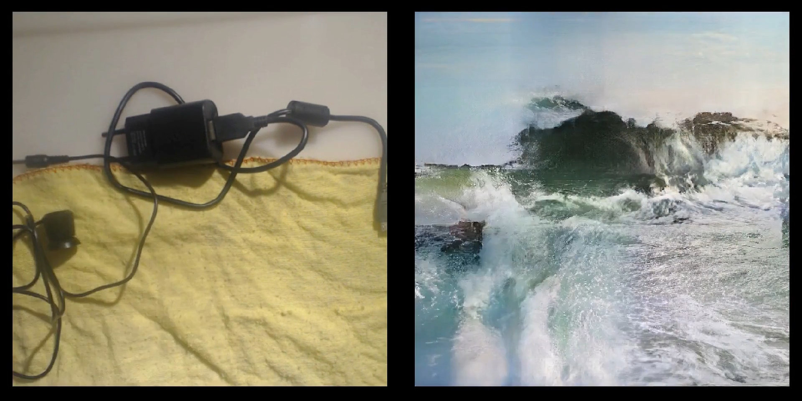

# Video (Live Input) Artworks 

## Shinseungback Kimyonghun — Nonfacial portrait (2018)

[Project page](https://ssbkyh.com/works/nonfacial_portrait)

```{margin}
Shinseungback Kimyonghun — Nonfacial portrait (2018)<br>
Face detection software, camera, computer, monitor, canvas, smartphone, table and wooden panel, Variable dimensions
```


<br>

```{margin}
Shinseungback Kimyonghun — Nonfacial portrait (2018)<br>
Face detection software, camera, computer, monitor, canvas, smartphone, table and wooden panel, Variable dimensions
```


<br>

## Johanna Reich — Face Detection (2018)

[Project page](https://johannareich.com/project/home-works-face-detection/)

```{margin}
Johanna Reich — Face Detection (2018)<br>
HD Video, 5 forms of clay
```


<br>

> "In her work „Face Detecion“ JOHANNA REICH explores the relationship between man and machine in the digital age. In front of a smartphone camera with face detection she is forming clumps of clay until they were recognized by the facial recognition program of the smartphone as humans. At the point of recognition she stops forming. When does the human appear? When does it disappear? And: What does humanity actually look like? The Software obviously has a sense of abstraction, because it discovers it already in roughly worked lumps." (Website)


## Dries Depoorter — Surveillance Paparazzi (2018) 

[Project page](https://driesdepoorter.be/surveillance-paparazzi/)

```{margin}
Dries Depoorter — Surveillance Paparazzi (2018)
```


<br>

```{margin}
Dries Depoorter — Surveillance Paparazzi (2018)
```


<br>

```{margin}
Dries Depoorter — Surveillance Paparazzi (2018)
```


<br>

> ‘Surveillance Paparazzi’ tries to take a paparazzi photo with the use AI and unsecured surveillance cameras from all over the world.
> 
> ‘Surveillance Paparazzi’ thematises the phenomenon of artificial intelligence and global surveillance in public space. The work taps into various surveillance cameras worldwide that record and transmit unencrypted images. It was possible to hack into these cameras via the Internet so that live recordings of stores, entryways, and public spaces could be directly integrated into the work.
> The installation can recognise more than 200K celebrities and searches them in more than 1000 unsecured cameras all over the world. When Depoorter’s software recognises publicly known persons, with the help of artificial intelligence, the image becomes visible in real-time within the exhibition. Surveillance Paparazzi’s monitors then show the name of the VIP, the live image, an official image from Wikipedia, and the corresponding GPS location on a world map..


## Memo Akten — Learning to see: Gloomy Sunday (2017)

[Project page](https://www.memo.tv/works/gloomy-sunday/)

```{margin}
Memo Akten — Learning to see: Gloomy Sunday (2017)<br>
HD Video. Duration: 3:02. Technique: Custom software, Artificial Intelligence, Machine Learning, Deep Learning, Generative Adversarial Networks.
```


<br>

```{margin}
Memo Akten — Learning to see: Gloomy Sunday (2017)<br>
HD Video. Duration: 3:02. Technique: Custom software, Artificial Intelligence, Machine Learning, Deep Learning, Generative Adversarial Networks.
```



<br>

## Ursula Damm — Membrane (2019) 

[Project page](https://ursuladamm.de/membrane-2019/)

```{margin}
Ursula Damm — Membrane (2019)<br>
Membrane at Entangled Realities – Leben mit künstlicher Intelligenz im HeK (Haus der elektronischen Künste Basel), 08.05.-11.08.2019. Foto: Sabine Himmlsbach.
```


<br>

```{margin}
Ursula Damm — Membrane (2019)<br>
Interface
```


<br>